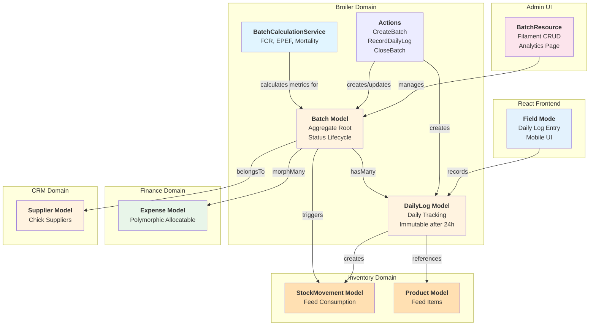
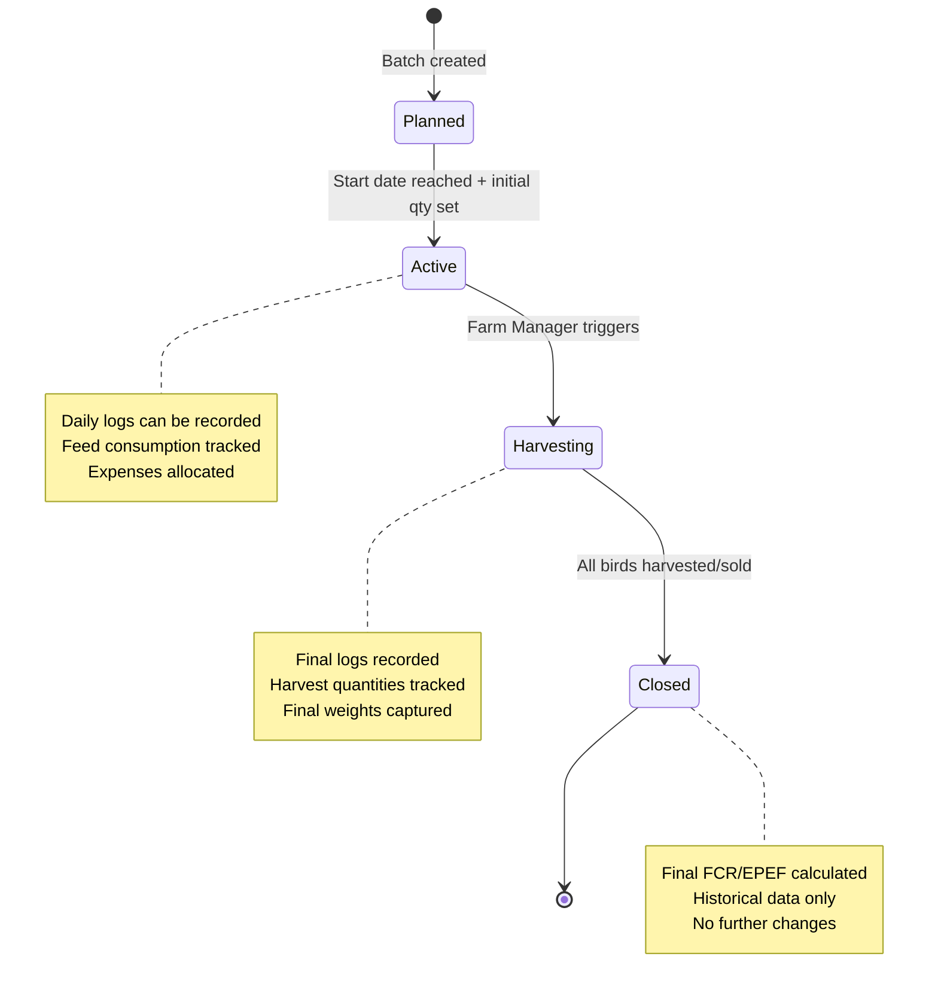

# Phase 3 Plan: Broiler Domain (MVP Core)

**Status:** Planning
**Focus:** Core farm operations for broiler chicken farming
**Target Date:** Current session
**Estimated Effort:** 16-20 hours (2-3 working days)

---

## Overview

Phase 3 delivers the **core MVP functionality** of Farmsense: complete broiler chicken batch management with daily log tracking, financial integration, and performance analytics. This phase introduces the first React frontend feature ("Field Mode") for workers to input daily farm data.

### Three Major Feature Areas:

1. **Batch Engine** - Lifecycle management (Planned → Active → Harvesting → Closed) with business rules
2. **React Frontend "Field Mode"** - Mobile-friendly daily log entry UI for field workers
3. **Analytics & Financial Integration** - FCR/EPEF calculations, expense allocation, and feed consumption tracking

---

## Detailed Tasks

### STEP 1: Create Broiler Domain Structure

**Files to Create:**

Domain Models:
- `Domains/Broiler/Models/Batch.php` - Aggregate root for flock lifecycle
- `Domains/Broiler/Models/DailyLog.php` - Daily tracking (mortality, feed, water, temp)
- `Domains/Broiler/Enums/BatchStatus.php` - Planned, Active, Harvesting, Closed
- `Domains/Broiler/DTOs/BatchData.php` - Type-safe batch data
- `Domains/Broiler/DTOs/DailyLogData.php` - Type-safe daily log data

Services & Actions:
- `Domains/Broiler/Services/BatchCalculationService.php` - FCR, EPEF, mortality rate calculations
- `Domains/Broiler/Actions/CreateBatchAction.php` - Batch creation with validation
- `Domains/Broiler/Actions/RecordDailyLogAction.php` - Daily log with stock movement integration
- `Domains/Broiler/Actions/CloseBatchAction.php` - Batch closure with final calculations

**Database Migrations:**

- `create_batches_table` - Batch metadata (team-scoped)
  - Fields: name, batch_number, start_date, expected_end_date, actual_end_date, status
  - Fields: initial_quantity, current_quantity, supplier_id (chick supplier)
  - Fields: target_weight_kg, average_weight_kg (calculated)
  - Timestamps: created_at, updated_at

- `create_daily_logs_table` - Daily tracking (team-scoped)
  - Fields: batch_id, log_date, mortality_count, feed_consumed_kg, water_consumed_liters
  - Fields: temperature_celsius, humidity_percent, notes
  - Fields: recorded_by (user_id), created_at, updated_at
  - Index: unique(batch_id, log_date) - One log per day per batch

**Key Relationships:**

```
Batch (team-scoped, aggregate root)
  └── hasMany DailyLog
  └── hasMany Expense (morphMany via Allocatable interface)
  └── hasMany StockMovement (via feed consumption)
  └── belongsTo Supplier (chick supplier)

DailyLog (team-scoped, immutable after 24h)
  └── belongsTo Batch
  └── belongsTo User (recorder)
  └── Auto-creates StockMovement when feed consumed
  └── Can trigger Expense creation for mortality/medication
```

**Business Rules:**

1. **Batch Status Transitions:**
   - Planned → Active (when start_date reached and initial_quantity set)
   - Active → Harvesting (manual trigger by Farm Manager)
   - Harvesting → Closed (when all birds harvested/sold)
   - No backward transitions allowed

2. **Daily Log Rules:**
   - One log per day per batch (unique constraint)
   - Can only edit today's log (immutable after 24 hours)
   - Auto-calculates current_quantity = yesterday's quantity - today's mortality
   - Feed consumption creates StockMovement (Out) for inventory tracking

3. **Calculations:**
   - **FCR (Feed Conversion Ratio)** = Total Feed (kg) / Total Weight Gain (kg)
     - Lower is better (ideal: 1.6-1.9 for broilers)
   - **EPEF (European Production Efficiency Factor)** = (Liveability% × Avg Weight kg × 100) / (Age days × FCR)
     - Higher is better (ideal: 300-400)
   - **Mortality Rate** = (Total Deaths / Initial Quantity) × 100

---

### STEP 2: Create Filament Resources (Admin UI)

**New Resources:**

- `BatchResource` - Full CRUD for batch planning and monitoring
  - Form: Batch details, chick supplier, initial quantity, target weight
  - Table: Batch list with status badges, current quantity, age in days
  - Actions: Start batch, harvest, close, view analytics
  - Relation managers: DailyLogs, Expenses

**Resource Features:**

- Batch creation wizard (multi-step form):
  - Step 1: Basic info (name, batch number, dates)
  - Step 2: Chick details (supplier, quantity, cost)
  - Step 3: Target metrics (weight, FCR, EPEF)

- Batch analytics view (custom page):
  - Current stats: Age, mortality %, FCR, EPEF
  - Charts: Daily mortality trend, feed consumption, weight gain
  - Financial summary: Total costs, cost per bird, projected revenue

- Daily log relation manager:
  - Table: Date, mortality, feed, water, temperature
  - Quick entry form for today's log
  - Auto-calculated current quantity

**Pages to Create:**

- `app/Filament/Resources/BatchResource.php`
- `app/Filament/Resources/BatchResource/Pages/ListBatches.php`
- `app/Filament/Resources/BatchResource/Pages/CreateBatch.php`
- `app/Filament/Resources/BatchResource/Pages/EditBatch.php`
- `app/Filament/Resources/BatchResource/Pages/ViewBatch.php`
- `app/Filament/Resources/BatchResource/Pages/BatchAnalytics.php` (custom page)
- `app/Filament/Resources/BatchResource/RelationManagers/DailyLogsRelationManager.php`
- `app/Filament/Resources/BatchResource/RelationManagers/ExpensesRelationManager.php`

---

### STEP 3: Create React "Field Mode" Frontend

**Purpose:**

Build a mobile-friendly interface for field workers to quickly record daily farm data without navigating complex admin interfaces. This is the first user-facing React feature.

**New React Pages:**

- `resources/js/pages/Batches/Index.tsx` - Active batch dashboard
- `resources/js/pages/Batches/Show.tsx` - Batch details with daily log history
- `resources/js/pages/Batches/DailyLog/Create.tsx` - Quick daily log entry form

**New React Components:**

- `resources/js/components/broiler/BatchCard.tsx` - Batch summary card
- `resources/js/components/broiler/DailyLogForm.tsx` - Log entry form
- `resources/js/components/broiler/MetricsDisplay.tsx` - FCR/EPEF display
- `resources/js/components/broiler/MortalityChart.tsx` - Mortality trend chart
- `resources/js/components/broiler/FeedConsumptionChart.tsx` - Feed usage chart

**New Laravel Controllers:**

- `app/Http/Controllers/Batches/BatchController.php` - Batch CRUD
- `app/Http/Controllers/Batches/DailyLogController.php` - Log entry
- `app/Http/Controllers/Batches/BatchAnalyticsController.php` - Analytics data

**API Routes:**

```php
// routes/web.php (Inertia routes)
Route::middleware(['auth'])->group(function () {
    // Batch management
    Route::get('/batches', [BatchController::class, 'index'])->name('batches.index');
    Route::get('/batches/{batch}', [BatchController::class, 'show'])->name('batches.show');

    // Daily log entry
    Route::get('/batches/{batch}/daily-log/create', [DailyLogController::class, 'create'])
        ->name('batches.daily-log.create');
    Route::post('/batches/{batch}/daily-log', [DailyLogController::class, 'store'])
        ->name('batches.daily-log.store');

    // Analytics
    Route::get('/batches/{batch}/analytics', [BatchAnalyticsController::class, 'show'])
        ->name('batches.analytics');
});
```

**UI Features:**

1. **Batch Dashboard:**
   - List of active batches with key metrics
   - Quick stats: Age, current quantity, mortality %
   - "Record Today's Log" quick action button

2. **Daily Log Entry Form:**
   - Large touch-friendly inputs for mobile
   - Pre-filled date (today)
   - Fields: Mortality count, feed consumed, water consumed, temperature, notes
   - Auto-calculated current quantity display
   - Submit creates StockMovement for feed

3. **Batch Details View:**
   - Full batch info and timeline
   - Daily log history table
   - Charts: Mortality trend, feed consumption
   - Financial summary (from allocated expenses)

---

### STEP 4: Financial Integration

**Integration Points:**

1. **Feed Consumption → Stock Movements:**
   - When daily log recorded with feed_consumed_kg
   - Auto-create StockMovement (type: Out) for feed product
   - Link StockMovement to Batch via reference field

2. **Batch Expenses → Finance Domain:**
   - Batch implements Allocatable interface
   - Expenses can be allocated to specific batches
   - Auto-calculate cost per bird, cost per kg

3. **Chick Purchase → Initial Expense:**
   - When batch created, optionally create Expense for chick purchase
   - Links to Supplier and Batch
   - Included in total batch cost

**Financial Reports:**

- Total batch cost (chicks + feed + medication + labor)
- Cost per bird alive
- Cost per kg harvested
- Projected profit/loss based on target selling price

---

### STEP 5: Analytics Implementation

**Service: BatchCalculationService**

```php
class BatchCalculationService
{
    public function calculateFCR(Batch $batch): float
    {
        // FCR = Total Feed Consumed (kg) / Total Weight Gain (kg)
        $totalFeed = $batch->dailyLogs->sum('feed_consumed_kg');
        $weightGain = $batch->average_weight_kg * $batch->current_quantity;
        return $totalFeed > 0 ? round($totalFeed / $weightGain, 2) : 0;
    }

    public function calculateEPEF(Batch $batch): float
    {
        // EPEF = (Liveability% × Avg Weight kg × 100) / (Age days × FCR)
        $liveability = ($batch->current_quantity / $batch->initial_quantity) * 100;
        $avgWeight = $batch->average_weight_kg;
        $age = $batch->start_date->diffInDays(now());
        $fcr = $this->calculateFCR($batch);

        return $fcr > 0 ? round(($liveability * $avgWeight * 100) / ($age * $fcr), 2) : 0;
    }

    public function calculateMortalityRate(Batch $batch): float
    {
        // Mortality Rate = (Total Deaths / Initial Quantity) × 100
        $totalDeaths = $batch->dailyLogs->sum('mortality_count');
        return round(($totalDeaths / $batch->initial_quantity) * 100, 2);
    }

    public function calculateCostPerBird(Batch $batch): int
    {
        // Total allocated expenses / current quantity
        $totalCostCents = $batch->expenses->sum('amount_cents');
        return $batch->current_quantity > 0
            ? (int) ($totalCostCents / $batch->current_quantity)
            : 0;
    }
}
```

**Metrics to Display:**

- Current Stats:
  - Age (days since start)
  - Current quantity (initial - total mortality)
  - Mortality rate %
  - Average weight (kg)
  - FCR (Feed Conversion Ratio)
  - EPEF (European Production Efficiency Factor)

- Financial Stats:
  - Total cost (all allocated expenses)
  - Cost per bird alive
  - Cost per kg (total cost / total weight)
  - Projected revenue (if selling price set)

---

### STEP 6: Create Database Seeders

**New Seeders:**

- `BatchSeeder` - 2-3 batches per team
  - 1 Planned batch (future start date)
  - 1 Active batch (started 20 days ago)
  - 1 Closed batch (historical data)

- `DailyLogSeeder` - Daily logs for active/closed batches
  - 20 days of logs for active batch
  - 42 days of logs for closed batch
  - Realistic mortality progression (low early, spike mid-cycle, low late)
  - Realistic feed consumption (increases with age)

**Seed Data Patterns:**

Active Batch Example:
- Name: "Batch BRO-2025-001"
- Start Date: 20 days ago
- Initial Quantity: 1000 chicks
- Current Quantity: 965 (35 deaths over 20 days)
- Daily Logs: 20 entries with increasing feed consumption
- Status: Active

Closed Batch Example:
- Name: "Batch BRO-2024-042"
- Start Date: 60 days ago
- End Date: 18 days ago (42-day cycle)
- Initial Quantity: 800 chicks
- Final Quantity: 762 (38 deaths, 4.75% mortality)
- Daily Logs: 42 entries
- Status: Closed
- Average Weight: 2.3 kg
- FCR: 1.78 (good performance)
- EPEF: 351 (excellent)

---

### STEP 7: Create Tests

**Feature Tests:**

Domain Tests:
- `Domains/Broiler/Tests/Feature/BatchManagementTest` - CRUD, status transitions
- `Domains/Broiler/Tests/Feature/DailyLogRecordingTest` - Log creation, validation
- `Domains/Broiler/Tests/Feature/BatchCalculationsTest` - FCR, EPEF, mortality
- `Domains/Broiler/Tests/Feature/BatchFinancialIntegrationTest` - Expense allocation
- `Domains/Broiler/Tests/Feature/FeedConsumptionTrackingTest` - StockMovement creation

Frontend Tests (Pest + Browser):
- `tests/Browser/Batches/BatchDashboardTest` - Active batches display
- `tests/Browser/Batches/DailyLogEntryTest` - Form submission, validation
- `tests/Browser/Batches/BatchAnalyticsTest` - Charts and metrics display

**Unit Tests:**

- `Domains/Broiler/Tests/Unit/BatchCalculationServiceTest` - All calculation methods
- `Domains/Broiler/Tests/Unit/BatchStatusTest` - Enum values, transitions
- `Domains/Broiler/Tests/Unit/DTOs/BatchDataTest` - DTO validation
- `Domains/Broiler/Tests/Unit/DTOs/DailyLogDataTest` - DTO validation

**Test Coverage Goal:** >90% for Broiler domain

---

## Implementation Order

1. ✅ Create Broiler domain structure (models, enums, DTOs, migrations)
2. ✅ Create services and actions (BatchCalculationService, actions)
3. ✅ Create Filament BatchResource with analytics page
4. ✅ Create database seeders for realistic test data
5. ✅ Create React "Field Mode" frontend (pages, components, controllers)
6. ✅ Implement financial integration (Allocatable, StockMovements)
7. ✅ Write comprehensive test suite (feature + unit)
8. ✅ Create git commits with detailed messages
9. ✅ Create Phase 3 Implementation Report

---

## Success Criteria

- [x] 2 new domain models (Batch, DailyLog) with proper relationships
- [x] 2 new migrations without errors
- [x] 2 Spatie DTOs implemented
- [x] 1 Filament Resource (BatchResource) with 6 pages + 2 relation managers
- [x] 3 React pages for "Field Mode"
- [x] 5+ React components for broiler features
- [x] 3 Laravel controllers for Inertia routes
- [x] BatchCalculationService with 4+ calculation methods
- [x] 2 seeders with realistic test data
- [x] 12+ tests (8 feature, 4 unit) with >90% coverage
- [x] All tests passing
- [x] Code formatted with Pint and Prettier
- [x] Financial integration (Expenses + StockMovements) working
- [x] Git commits with detailed messages

---

## Deliverables

**Backend:**
- Complete Broiler domain (models, services, actions)
- Batch lifecycle management with business rules
- FCR/EPEF calculation engine
- Financial integration (expense allocation, feed tracking)

**Admin UI (Filament):**
- BatchResource with full CRUD
- Batch analytics dashboard
- Daily log relation manager
- Expense allocation interface

**Frontend UI (React):**
- Active batch dashboard for workers
- Mobile-friendly daily log entry form
- Batch details with charts and metrics
- Real-time FCR/EPEF display

**Data:**
- 2-3 batches per team with realistic lifecycle data
- 60+ daily logs across batches
- Proper expense and stock movement integration

---

## Architecture Diagram



---

## Business Rules Summary

### Batch Status Workflow



### Daily Log Business Logic

1. **One Log Per Day Rule:**
   - Database constraint: unique(batch_id, log_date)
   - UI prevents duplicate entries for same day

2. **Immutability Rule:**
   - Can edit today's log
   - Yesterday's log becomes read-only at midnight
   - Prevents data manipulation after the fact

3. **Auto-Calculations:**
   - Current quantity = yesterday's qty - today's mortality
   - Cumulative feed = sum of all feed_consumed_kg
   - Age in days = log_date - batch.start_date

4. **Stock Integration:**
   - Feed consumption creates StockMovement (type: Out)
   - Links to feed product and warehouse
   - Auto-updates product.quantity_on_hand

---

## Key Performance Indicators (KPIs)

**Operational KPIs:**
- Mortality rate % (target: <5%)
- FCR - Feed Conversion Ratio (target: 1.6-1.9)
- EPEF - European Production Efficiency Factor (target: 300-400)
- Average weight at harvest (target: 2.0-2.5 kg at 42 days)

**Financial KPIs:**
- Cost per bird (target: BWP 45-55)
- Cost per kg (target: BWP 20-25)
- Feed cost as % of total cost (typical: 60-70%)
- Profit margin per batch (target: 15-25%)

**Efficiency KPIs:**
- Days to reach target weight (target: 35-42 days)
- Feed wastage % (target: <3%)
- Water consumption per bird (typical: 1.8-2.2 liters/day)
- Temperature variance (target: ±2°C from ideal)

---

## Mobile UI Considerations

**Field Mode Design Principles:**

1. **Touch-Friendly:**
   - Large buttons (min 44px tap targets)
   - Adequate spacing between inputs
   - Number pads for numeric inputs

2. **Fast Data Entry:**
   - Auto-focus first input
   - Tab/Enter navigation
   - "Record & Done" single-action submit

3. **Offline-First (Future):**
   - Phase 3: Online only
   - Phase 4+: Service worker for offline entry
   - Sync when connection restored

4. **Minimal Navigation:**
   - Dashboard → Select Batch → Enter Log → Done
   - 3-click workflow maximum

5. **Visual Feedback:**
   - Success toast on save
   - Error highlights on validation
   - Loading states during submission

---

## Integration with Phase 2

**Inventory Integration:**
- DailyLog creates StockMovement when feed consumed
- StockMovement.reference = "Batch {batch_number} - Daily Log {date}"
- Product.quantity_on_hand auto-decremented

**Finance Integration:**
- Batch implements Allocatable interface (from Phase 1)
- Expenses can be allocated to batches
- Expense types: Chicks, Feed, Medication, Labor, Utilities

**CRM Integration:**
- Batch links to Supplier (chick supplier)
- Future: Customer links for chicken sales

---

## Future Enhancements (Post-Phase 3)

**Phase 4+ Ideas:**

1. **IoT Sensor Integration:**
   - Auto-record temperature/humidity from sensors
   - Alerts for out-of-range conditions

2. **Harvest Management:**
   - Record harvest quantities, weights, grades
   - Link to customer orders/invoices

3. **Medication Scheduling:**
   - Vaccination calendar per batch
   - Medication log with cost tracking

4. **Predictive Analytics:**
   - ML model for mortality prediction
   - Optimal harvest date suggestion
   - Feed consumption forecasting

5. **Multi-House Management:**
   - Track multiple houses per farm
   - House-specific batches and logs

---

## Next Steps (After Phase 3)

**Phase 4: Polish & Documentation**
- Audit logs for all critical events
- API documentation (Scramble)
- Code quality (Larastan static analysis)
- CI/CD pipeline setup

**Phase 5: Additional Domains**
- Layers domain (egg production)
- Hatchery domain (chick breeding)
- Livestock domain (cattle, pigs)

**Phase 6: IoT Integration**
- Sensor/device management
- Real-time data ingestion
- Automated alerts

---

**Plan Version:** 1.0
**Created:** 2025-12-06
**Next Review:** After Phase 3 Implementation
