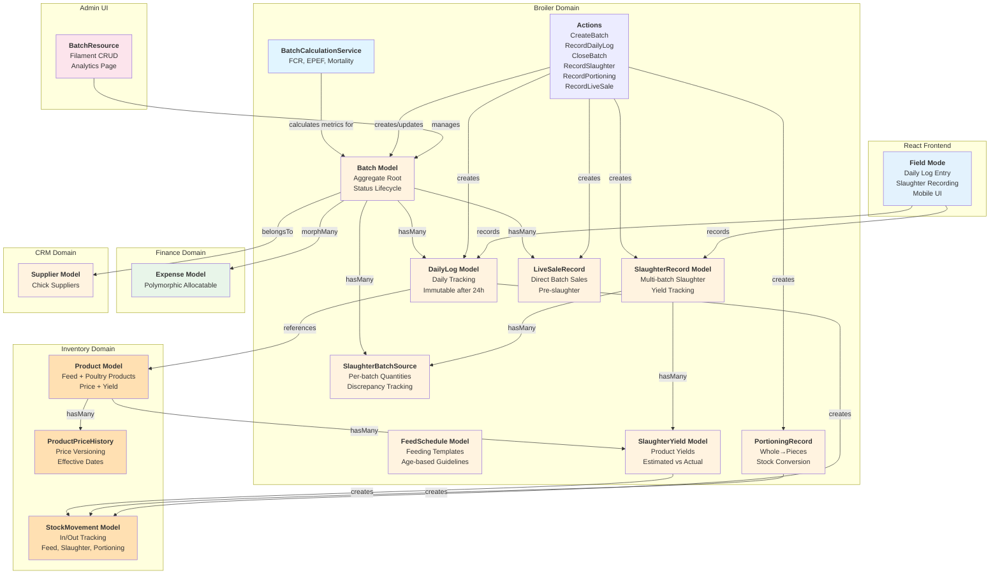
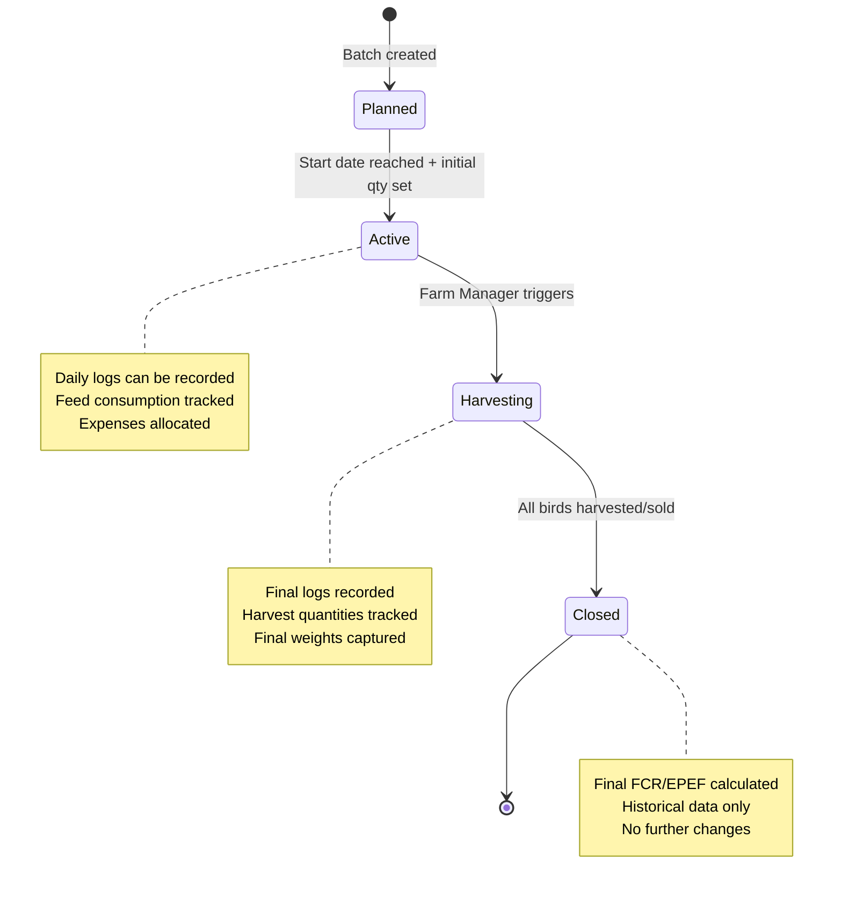

# Phase 3 Plan: Broiler Domain (MVP Core)

**Status:** 🔄 IN PROGRESS (Backend ~85% | Frontend ~40%)
**Focus:** Core farm operations for broiler chicken farming
**Target Date:** TBD
**Estimated Remaining Effort:** 12-16 hours
**Last Updated:** 2025-12-09

---

## Overview

Phase 3 delivers the **core MVP functionality** of Farmsense: complete broiler chicken batch management with daily log tracking, financial integration, performance analytics, **slaughter processing**, **product management**, and **inventory integration**. This phase introduces the first React frontend feature ("Field Mode") for workers to input daily farm data.

### Five Major Feature Areas

1. **Batch Engine** - Lifecycle management (Planned → Active → Harvesting → Closed) with business rules ✅
2. **React Frontend "Field Mode"** - Mobile-friendly daily log entry UI for field workers ✅
3. **Analytics & Financial Integration** - FCR/EPEF calculations, expense allocation, and feed consumption tracking ✅
4. **Slaughter & Portioning System** - Multi-batch slaughter, yield tracking, discrepancy management ✅
5. **Product Catalog & Pricing** - Poultry products with versioned pricing, packaging units, yield calculations ✅

### Current Status Summary

**⚠️ CRITICAL: Phase 3 has significant gaps - see [PHASE_3_GAP_ANALYSIS.md](./PHASE_3_GAP_ANALYSIS.md)**

**What Was Built (Backend ~85%):**

- **15 Domain Models** ✅ - Batch, DailyLog, SlaughterRecord, SlaughterBatchSource, SlaughterYield, PortioningRecord, LiveSaleRecord, FeedSchedule, ProductPriceHistory
- **8 DTOs** ✅ - BatchData, DailyLogData, SlaughterData, SlaughterBatchSourceData, SlaughterYieldData, PortioningData, LiveSaleData, ProductPriceUpdateData
- **8 Actions** ✅ - CreateBatch, RecordDailyLog, CloseBatch, RecordSlaughter, RecordPortioning, RecordLiveSale, CalculateSlaughterYields, UpdateProductPrice
- **Partial Controllers** 🔄 - Only `store()` methods implemented, missing full CRUD
- **10 React Components** ✅ - BatchCard, BatchForm, DailyLogForm, SlaughterForm, PortioningForm, LiveSaleForm, CustomerForm, MetricsDisplay, FeedConsumptionChart, MortalityChart
- **165+ Passing Tests** ✅ - Comprehensive feature and unit test coverage
- **Quick Actions Sheet** ✅ - Unified UI pattern for rapid data entry

**What's Missing (Frontend ~40%):**

- ❌ **No CRUD Pages** - Missing Index/Show pages for Slaughter, Portioning, LiveSales, Customers, Suppliers, Warehouses, StockMovements
- ❌ **Broken Navigation** - 12 out of 15 sidebar links lead to 404 errors
- ❌ **Incomplete Controllers** - Missing `index()`, `show()`, `edit()`, `update()`, `destroy()` methods
- ❌ **No History Views** - Cannot view past slaughter records, portioning sessions, or live sales
- ❌ **No Detail Pages** - Cannot click into records to see full details

**Architecture Decisions:**

- **Sheet-Based Forms**: All quick actions use bottom sheets for data entry (CREATE only)
- **Client-Side Yield Calculation**: Slaughter yields calculated in real-time
- **Versioned Pricing**: ProductPriceHistory tracks all price changes
- **Multi-Batch Slaughter**: Single slaughter session can pull from multiple batches
- **Discrepancy Notifications**: Automatic manager alerts for theft/loss detection

---

## Detailed Tasks

### STEP 1: Create Broiler Domain Structure ✅ COMPLETED

**Files Created:**

Domain Models:
- ✅ `Domains/Broiler/Models/Batch.php` - Aggregate root for flock lifecycle
- ✅ `Domains/Broiler/Models/DailyLog.php` - Daily tracking (mortality, feed, water, temp)
- ✅ `Domains/Broiler/Enums/BatchStatus.php` - Planned, Active, Harvesting, Closed
- ✅ `Domains/Broiler/DTOs/BatchData.php` - Type-safe batch data
- ✅ `Domains/Broiler/DTOs/DailyLogData.php` - Type-safe daily log data

Services & Actions:
- ✅ `Domains/Broiler/Services/BatchCalculationService.php` - FCR, EPEF, mortality rate calculations
- ✅ `Domains/Broiler/Actions/CreateBatchAction.php` - Batch creation with validation
- ✅ `Domains/Broiler/Actions/RecordDailyLogAction.php` - Daily log with stock movement integration
- ✅ `Domains/Broiler/Actions/CloseBatchAction.php` - Batch closure with final calculations

**Database Migrations:**

- `create_batches_table` - Batch metadata (team-scoped)
  - Fields: name, batch_number, start_date, expected_end_date, actual_end_date, status
  - Fields: initial_quantity, current_quantity, supplier_id (chick supplier)
  - Fields: target_weight_kg, average_weight_kg (calculated)
  - Timestamps: created_at, updated_at

- `create_daily_logs_table` - Daily tracking (team-scoped)
  - Fields: batch_id, log_date, mortality_count, feed_consumed_kg, water_consumed_liters
  - Fields: temperature_celsius, humidity_percent, notes
  - Fields: recorded_by (user_id), created_at, updated_at
  - Index: unique(batch_id, log_date) - One log per day per batch

**Key Relationships:**

```
Batch (team-scoped, aggregate root)
  └── hasMany DailyLog
  └── hasMany Expense (morphMany via Allocatable interface)
  └── hasMany StockMovement (via feed consumption)
  └── belongsTo Supplier (chick supplier)

DailyLog (team-scoped, immutable after 24h)
  └── belongsTo Batch
  └── belongsTo User (recorder)
  └── Auto-creates StockMovement when feed consumed
  └── Can trigger Expense creation for mortality/medication
```

**Business Rules:**

1. **Batch Status Transitions:**
   - Planned → Active (when start_date reached and initial_quantity set)
   - Active → Harvesting (manual trigger by Farm Manager)
   - Harvesting → Closed (when all birds harvested/sold)
   - No backward transitions allowed

2. **Daily Log Rules:**
   - One log per day per batch (unique constraint)
   - Can only edit today's log (immutable after 24 hours)
   - Auto-calculates current_quantity = yesterday's quantity - today's mortality
   - Feed consumption creates StockMovement (Out) for inventory tracking

3. **Calculations:**
   - **FCR (Feed Conversion Ratio)** = Total Feed (kg) / Total Weight Gain (kg)
     - Lower is better (ideal: 1.6-1.9 for broilers)
   - **EPEF (European Production Efficiency Factor)** = (Liveability% × Avg Weight kg × 100) / (Age days × FCR)
     - Higher is better (ideal: 300-400)
   - **Mortality Rate** = (Total Deaths / Initial Quantity) × 100

---

### STEP 2: Create Filament Resources (Admin UI)

**New Resources:**

- `BatchResource` - Full CRUD for batch planning and monitoring
  - Form: Batch details, chick supplier, initial quantity, target weight
  - Table: Batch list with status badges, current quantity, age in days
  - Actions: Start batch, harvest, close, view analytics
  - Relation managers: DailyLogs, Expenses

**Resource Features:**

- Batch creation wizard (multi-step form):
  - Step 1: Basic info (name, batch number, dates)
  - Step 2: Chick details (supplier, quantity, cost)
  - Step 3: Target metrics (weight, FCR, EPEF)

- Batch analytics view (custom page):
  - Current stats: Age, mortality %, FCR, EPEF
  - Charts: Daily mortality trend, feed consumption, weight gain
  - Financial summary: Total costs, cost per bird, projected revenue

- Daily log relation manager:
  - Table: Date, mortality, feed, water, temperature
  - Quick entry form for today's log
  - Auto-calculated current quantity

**Pages to Create:**

- `app/Filament/Resources/BatchResource.php`
- `app/Filament/Resources/BatchResource/Pages/ListBatches.php`
- `app/Filament/Resources/BatchResource/Pages/CreateBatch.php`
- `app/Filament/Resources/BatchResource/Pages/EditBatch.php`
- `app/Filament/Resources/BatchResource/Pages/ViewBatch.php`
- `app/Filament/Resources/BatchResource/Pages/BatchAnalytics.php` (custom page)
- `app/Filament/Resources/BatchResource/RelationManagers/DailyLogsRelationManager.php`
- `app/Filament/Resources/BatchResource/RelationManagers/ExpensesRelationManager.php`

---

### STEP 3: Create React "Field Mode" Frontend

**Purpose:**

Build a mobile-friendly interface for field workers to quickly record daily farm data without navigating complex admin interfaces. This is the first user-facing React feature.

**New React Pages:**

- `resources/js/pages/Batches/Index.tsx` - Active batch dashboard
- `resources/js/pages/Batches/Show.tsx` - Batch details with daily log history
- `resources/js/pages/Batches/DailyLog/Create.tsx` - Quick daily log entry form

**New React Components:**

- `resources/js/components/broiler/BatchCard.tsx` - Batch summary card
- `resources/js/components/broiler/DailyLogForm.tsx` - Log entry form
- `resources/js/components/broiler/MetricsDisplay.tsx` - FCR/EPEF display
- `resources/js/components/broiler/MortalityChart.tsx` - Mortality trend chart
- `resources/js/components/broiler/FeedConsumptionChart.tsx` - Feed usage chart

**New Laravel Controllers:**

- `app/Http/Controllers/Batches/BatchController.php` - Batch CRUD
- `app/Http/Controllers/Batches/DailyLogController.php` - Log entry
- `app/Http/Controllers/Batches/BatchAnalyticsController.php` - Analytics data

**API Routes:**

```php
// routes/web.php (Inertia routes)
Route::middleware(['auth'])->group(function () {
    // Batch management
    Route::get('/batches', [BatchController::class, 'index'])->name('batches.index');
    Route::get('/batches/{batch}', [BatchController::class, 'show'])->name('batches.show');

    // Daily log entry
    Route::get('/batches/{batch}/daily-log/create', [DailyLogController::class, 'create'])
        ->name('batches.daily-log.create');
    Route::post('/batches/{batch}/daily-log', [DailyLogController::class, 'store'])
        ->name('batches.daily-log.store');

    // Analytics
    Route::get('/batches/{batch}/analytics', [BatchAnalyticsController::class, 'show'])
        ->name('batches.analytics');
});
```

**UI Features:**

1. **Batch Dashboard:**
   - List of active batches with key metrics
   - Quick stats: Age, current quantity, mortality %
   - "Record Today's Log" quick action button

2. **Daily Log Entry Form:**
   - Large touch-friendly inputs for mobile
   - Pre-filled date (today)
   - Fields: Mortality count, feed consumed, water consumed, temperature, notes
   - Auto-calculated current quantity display
   - Submit creates StockMovement for feed

3. **Batch Details View:**
   - Full batch info and timeline
   - Daily log history table
   - Charts: Mortality trend, feed consumption
   - Financial summary (from allocated expenses)

---

### STEP 4: Financial Integration

**Integration Points:**

1. **Feed Consumption → Stock Movements:**
   - When daily log recorded with feed_consumed_kg
   - Auto-create StockMovement (type: Out) for feed product
   - Link StockMovement to Batch via reference field

2. **Batch Expenses → Finance Domain:**
   - Batch implements Allocatable interface
   - Expenses can be allocated to specific batches
   - Auto-calculate cost per bird, cost per kg

3. **Chick Purchase → Initial Expense:**
   - When batch created, optionally create Expense for chick purchase
   - Links to Supplier and Batch
   - Included in total batch cost

**Financial Reports:**

- Total batch cost (chicks + feed + medication + labor)
- Cost per bird alive
- Cost per kg harvested
- Projected profit/loss based on target selling price

---

### STEP 5: Analytics Implementation

**Service: BatchCalculationService**

```php
class BatchCalculationService
{
    public function calculateFCR(Batch $batch): float
    {
        // FCR = Total Feed Consumed (kg) / Total Weight Gain (kg)
        $totalFeed = $batch->dailyLogs->sum('feed_consumed_kg');
        $weightGain = $batch->average_weight_kg * $batch->current_quantity;
        return $totalFeed > 0 ? round($totalFeed / $weightGain, 2) : 0;
    }

    public function calculateEPEF(Batch $batch): float
    {
        // EPEF = (Liveability% × Avg Weight kg × 100) / (Age days × FCR)
        $liveability = ($batch->current_quantity / $batch->initial_quantity) * 100;
        $avgWeight = $batch->average_weight_kg;
        $age = $batch->start_date->diffInDays(now());
        $fcr = $this->calculateFCR($batch);

        return $fcr > 0 ? round(($liveability * $avgWeight * 100) / ($age * $fcr), 2) : 0;
    }

    public function calculateMortalityRate(Batch $batch): float
    {
        // Mortality Rate = (Total Deaths / Initial Quantity) × 100
        $totalDeaths = $batch->dailyLogs->sum('mortality_count');
        return round(($totalDeaths / $batch->initial_quantity) * 100, 2);
    }

    public function calculateCostPerBird(Batch $batch): int
    {
        // Total allocated expenses / current quantity
        $totalCostCents = $batch->expenses->sum('amount_cents');
        return $batch->current_quantity > 0
            ? (int) ($totalCostCents / $batch->current_quantity)
            : 0;
    }
}
```

**Metrics to Display:**

- Current Stats:
  - Age (days since start)
  - Current quantity (initial - total mortality)
  - Mortality rate %
  - Average weight (kg)
  - FCR (Feed Conversion Ratio)
  - EPEF (European Production Efficiency Factor)

- Financial Stats:
  - Total cost (all allocated expenses)
  - Cost per bird alive
  - Cost per kg (total cost / total weight)
  - Projected revenue (if selling price set)

---

### STEP 6: Create Database Seeders

**New Seeders:**

- `BatchSeeder` - 2-3 batches per team
  - 1 Planned batch (future start date)
  - 1 Active batch (started 20 days ago)
  - 1 Closed batch (historical data)

- `DailyLogSeeder` - Daily logs for active/closed batches
  - 20 days of logs for active batch
  - 42 days of logs for closed batch
  - Realistic mortality progression (low early, spike mid-cycle, low late)
  - Realistic feed consumption (increases with age)

**Seed Data Patterns:**

Active Batch Example:
- Name: "Batch BRO-2025-001"
- Start Date: 20 days ago
- Initial Quantity: 1000 chicks
- Current Quantity: 965 (35 deaths over 20 days)
- Daily Logs: 20 entries with increasing feed consumption
- Status: Active

Closed Batch Example:
- Name: "Batch BRO-2024-042"
- Start Date: 60 days ago
- End Date: 18 days ago (42-day cycle)
- Initial Quantity: 800 chicks
- Final Quantity: 762 (38 deaths, 4.75% mortality)
- Daily Logs: 42 entries
- Status: Closed
- Average Weight: 2.3 kg
- FCR: 1.78 (good performance)
- EPEF: 351 (excellent)

---

### STEP 7: Create Tests

**Feature Tests:**

Domain Tests:
- `Domains/Broiler/Tests/Feature/BatchManagementTest` - CRUD, status transitions
- `Domains/Broiler/Tests/Feature/DailyLogRecordingTest` - Log creation, validation
- `Domains/Broiler/Tests/Feature/BatchCalculationsTest` - FCR, EPEF, mortality
- `Domains/Broiler/Tests/Feature/BatchFinancialIntegrationTest` - Expense allocation
- `Domains/Broiler/Tests/Feature/FeedConsumptionTrackingTest` - StockMovement creation

Frontend Tests (Pest + Browser):
- `tests/Browser/Batches/BatchDashboardTest` - Active batches display
- `tests/Browser/Batches/DailyLogEntryTest` - Form submission, validation
- `tests/Browser/Batches/BatchAnalyticsTest` - Charts and metrics display

**Unit Tests:**

- `Domains/Broiler/Tests/Unit/BatchCalculationServiceTest` - All calculation methods
- `Domains/Broiler/Tests/Unit/BatchStatusTest` - Enum values, transitions
- `Domains/Broiler/Tests/Unit/DTOs/BatchDataTest` - DTO validation
- `Domains/Broiler/Tests/Unit/DTOs/DailyLogDataTest` - DTO validation

**Test Coverage Goal:** >90% for Broiler domain

---

### STEP 8: Extend Product Catalog for Poultry 🔄 NEW

**Purpose:**

Extend the Inventory domain to support poultry products with proper categorization, packaging units, yield calculations, and versioned pricing. Products sold include live birds, whole dressed chickens, chicken pieces, offal (feet, necks, gizzards, etc.), and by-products (manure).

**New Enums:**

- `Domains/Inventory/Enums/PackageUnit.php` - Piece, Kilogram, Cup, Bag, Pack
- `Domains/Broiler/Enums/FeedType.php` - Starter, Grower, Finisher
- `Domains/Broiler/Enums/DiscrepancyReason.php` - Theft, Death, Miscount, Other

**Extend ProductType Enum:**

```php
// Domains/Inventory/Enums/ProductType.php
enum ProductType: string
{
    // Existing
    case Feed = 'feed';
    case Medicine = 'medicine';
    case Packaging = 'packaging';
    case Equipment = 'equipment';
    case Other = 'other';
    
    // New for poultry
    case LiveBird = 'live_bird';
    case WholeChicken = 'whole_chicken';
    case ChickenPieces = 'chicken_pieces';
    case Offal = 'offal';
    case ByProduct = 'by_product';
}
```

**Enhance Product Model:**

Add fields to `products` table:
- `selling_price_cents` (bigint) - Current selling price in thebe
- `units_per_package` (decimal) - How many units per package (e.g., 6 necks, 10 feet, 0.5 kg)
- `package_unit` (enum: PackageUnit) - Unit of measurement
- `yield_per_bird` (decimal, nullable) - How many of this item per slaughtered bird (e.g., 2 for feet, 1 for heart)

**New Model: ProductPriceHistory**

Versioned pricing with automatic history tracking:
- `id`, `product_id` (FK)
- `selling_price_cents` - Price at this time
- `units_per_package` - Package size at this time
- `effective_from` (datetime) - When this price became active
- `effective_until` (datetime, nullable) - When this price ended (null = current)
- `changed_by` (FK to users) - Who made the change
- `notes` (text, nullable) - Reason for change

**Business Rules:**

1. When price changes via React frontend:
   - Close current price record (set `effective_until` to now)
   - Create new price record (set `effective_from` to now)
   - Historical reports use price effective at time of sale

2. `yield_per_bird` enables automatic yield estimation:
   - 100 birds × 2 feet/bird = 200 feet
   - 200 feet ÷ 10 feet/pack = 20 packs estimated

**Seed Products:**

| Product | Type | Yield/Bird | Units/Pack | Unit | Price (BWP) |
|---------|------|-----------|------------|------|-------------|
| Live Broiler | LiveBird | 1 | 1 | Piece | 82.00 |
| Whole Bird | WholeChicken | 1 | 1 | Piece | 80.00 |
| Chicken Pieces | ChickenPieces | — | 0.5 | Kg | 30.00 |
| Feet/Runaways | Offal | 2 | 10 | Pack | 12.00 |
| Necks/Melala | Offal | 1 | 6 | Pack | 12.00 |
| Gizzards/Dintshu | Offal | 1 | 6 | Pack | 15.00 |
| Livers/Debete | Offal | 1 | 6 | Pack | 12.00 |
| Hearts/Dipelo | Offal | 1 | 10 | Pack | 5.00 |
| Intestines/Mala | Offal | 1 | 1 | Cup | 15.00 |
| Heads/Thogo | Offal | 1 | 20 | Pack | 20.00 |
| Manure/Motshetelo | ByProduct | — | 50 | Bag | 50.00 |

---

### STEP 9: Create Feed Schedule System 🔄 NEW

**Purpose:**

Track recommended feeding schedules based on bird age. Different feed types (Starter, Grower, Finisher) are used at different growth stages. This helps workers know which feed to use and expected consumption rates.

**New Enum: FeedType**

```php
// Domains/Broiler/Enums/FeedType.php
enum FeedType: string
{
    case Starter = 'starter';   // Days 1-28
    case Grower = 'grower';     // Days 29-42
    case Finisher = 'finisher'; // Days 43-49
    
    public function label(): string { ... }
    public function ageRange(): string { ... }
}
```

**New Model: FeedSchedule**

Team-scoped feeding templates:
- `id`, `team_id` (FK)
- `name` - Schedule name (e.g., "Standard Broiler Schedule")
- `week_number` (int) - Week of cycle (1-7)
- `age_days_start` (int) - Starting age for this phase
- `age_days_end` (int) - Ending age for this phase
- `feed_type` (enum: FeedType) - Starter/Grower/Finisher
- `feed_per_100_birds_kg` (decimal) - Expected daily feed per 100 birds
- `supplement_kg` (decimal, nullable) - Additional supplements (Moroko)
- `notes` (text, nullable)

**Default Feed Schedule (per your guidelines):**

| Week | Days | Feed Type | Feed/100 Birds/Day (kg) | Supplement (kg) |
|------|------|-----------|------------------------|-----------------|
| 1 | 1-7 | Starter | 2.2 | 0 |
| 2 | 8-14 | Starter | 4.0 | ~0.87 |
| 3 | 15-21 | Starter | 6.5 | ~0.87 |
| 4 | 22-28 | Starter | 9.5 | ~1.78 |
| 5 | 29-35 | Grower | 13.5 | ~3.4 |
| 6 | 36-42 | Grower | 17.0 | ~2.0 |
| 7 | 43-49 | Finisher | 17.0 | ~2.0 |

---

### STEP 10: Create Slaughter System 🔄 NEW

**Purpose:**

Record slaughter events that convert live birds from batches into sellable inventory products. Supports multi-batch slaughter (birds from different batches in one session), yield estimation with manual override, and discrepancy tracking (theft/loss detection).

**New Model: SlaughterRecord**

Master record for a slaughter session:
- `id`, `team_id` (FK)
- `slaughter_date` (date)
- `total_birds_slaughtered` (int) - Sum from all batch sources
- `total_live_weight_kg` (decimal) - Combined live weight
- `total_dressed_weight_kg` (decimal) - After processing
- `household_consumption_notes` (text, nullable) - What was kept for household
- `recorded_by` (FK to users)
- `notes` (text, nullable)
- `created_at`, `updated_at`

**New Model: SlaughterBatchSource**

Links slaughter to multiple batches with discrepancy tracking:
- `id`, `slaughter_record_id` (FK)
- `batch_id` (FK)
- `expected_quantity` (int) - Birds expected (what user intended to take)
- `actual_quantity` (int) - Birds actually available/slaughtered
- `discrepancy_reason` (enum: DiscrepancyReason, nullable) - Theft, Death, Miscount, Other
- `discrepancy_notes` (text, nullable) - Details about the discrepancy

**Business Rules:**

1. **Validation:** `expected_quantity` cannot exceed `Batch.current_quantity`
2. **Immediate Deduction:** When slaughter recorded, deduct `actual_quantity` from `Batch.current_quantity`
3. **Discrepancy Detection:** If `actual_quantity < expected_quantity`, require `discrepancy_reason`
4. **Manager Notification:** When discrepancy recorded, notify farm managers via `DiscrepancyNotification`

**New Model: SlaughterYield**

Products produced from slaughter:
- `id`, `slaughter_record_id` (FK)
- `product_id` (FK) - Links to Product (whole bird, feet, etc.)
- `estimated_quantity` (int) - Auto-calculated from `total_birds × yield_per_bird ÷ units_per_package`
- `actual_quantity` (int) - User-entered actual count
- `household_consumed` (int) - Remainder kept for household (estimated - actual)

**Yield Calculation Example:**

100 birds slaughtered:
- Whole Birds: 100 × 1 / 1 = **100 packs estimated**
- Feet: 100 × 2 / 10 = **20 packs estimated**
- Necks: 100 × 1 / 6 = **16 packs estimated** (16.67 rounded)
- Gizzards: 100 × 1 / 6 = **16 packs estimated**
- Livers: 100 × 1 / 6 = **16 packs estimated**
- Hearts: 100 × 1 / 10 = **10 packs estimated**
- Heads: 100 × 1 / 20 = **5 packs estimated**
- Intestines: 100 × 1 / 1 = **100 cups estimated**

User enters actuals, difference = household consumed.

**Stock Movement Integration:**

On slaughter completion, create `StockMovement` (type: In) for each `SlaughterYield`:
- `product_id` = yield product
- `quantity` = `actual_quantity`
- `reason` = "Slaughter Record #{id} - {date}"
- `notes` = Batch source details

---

### STEP 11: Create Portioning System 🔄 NEW

**Purpose:**

Convert whole birds from inventory into chicken pieces. This is a separate process from slaughter — whole birds are stock, and portioning converts them into pieces.

**New Model: PortioningRecord**

- `id`, `team_id` (FK)
- `portioning_date` (date)
- `whole_birds_used` (int) - Deducted from whole bird stock
- `packs_produced` (int) - Number of piece packs created
- `pack_weight_kg` (decimal) - Weight per pack (default 0.5kg)
- `recorded_by` (FK to users)
- `notes` (text, nullable)
- `created_at`, `updated_at`

**Stock Movement Integration:**

On portioning:
1. `StockMovement` (type: Out) for Whole Bird product - quantity = `whole_birds_used`
2. `StockMovement` (type: In) for Chicken Pieces product - quantity = `packs_produced`

**Business Rules:**

- No waste tracking (per user requirement) — just input whole birds, output piece packs
- Typical yield: 1 whole bird (~2kg) → ~3 packs of 0.5kg pieces (after bone/waste)

---

### STEP 12: Create Live Sale System 🔄 NEW

**Purpose:**

Record direct sales of live birds from batches. Live birds are sold before slaughter and deduct directly from `Batch.current_quantity`.

**New Model: LiveSaleRecord**

- `id`, `team_id` (FK)
- `batch_id` (FK) - Source batch
- `sale_date` (date)
- `quantity_sold` (int) - Number of live birds
- `unit_price_cents` (bigint) - Price per bird (from Product or override)
- `total_amount_cents` (bigint) - Calculated
- `customer_id` (FK to customers, nullable) - Optional customer link
- `recorded_by` (FK to users)
- `notes` (text, nullable)
- `created_at`, `updated_at`

**Business Rules:**

1. **Validation:** `quantity_sold` cannot exceed `Batch.current_quantity`
2. **Immediate Deduction:** Deduct from `Batch.current_quantity` on record creation
3. **No Stock Movement:** Live sales don't create inventory stock — they're direct batch sales
4. **Can link to Invoice:** In Phase 4, can create invoice line item for the sale

---

### STEP 13: Enhance Batch Closure 🔄 NEW

**Purpose:**

Enhance `CloseBatchAction` to support optional manure collection and require closure reason when birds remain in batch.

**Modifications to CloseBatchAction:**

Add parameters:
- `manure_bags_collected` (int, nullable) - Bags of manure collected at closure
- `closure_reason` (enum: DiscrepancyReason, required if `current_quantity > 0`)
- `closure_notes` (text, nullable) - Explanation for remaining birds

**Business Rules:**

1. **Manure Collection (Optional):**
   - If `manure_bags_collected > 0`, create `StockMovement` (type: In) for Manure product
   - Reference: "Batch {batch_number} - Closure Manure Collection"

2. **Closure with Remaining Birds:**
   - If `Batch.current_quantity > 0` at closure, require `closure_reason`
   - Notify managers of unexplained bird count (potential theft)

3. **Final Calculations:**
   - Calculate final FCR, EPEF, mortality rate
   - Store as batch statistics for historical reporting

---

### STEP 14: Implement Stock Movement Integration 🔄 NEW

**Purpose:**

Complete the `createFeedStockMovement()` stub in `RecordDailyLogAction` and integrate all operations with inventory.

**Feed Consumption (DailyLog → StockMovement):**

When daily log recorded with `feed_consumed_kg > 0`:
1. Look up team's default feed product (or product_id on daily log)
2. Create `StockMovement`:
   - `type` = Out
   - `product_id` = feed product
   - `quantity` = feed_consumed_kg
   - `reason` = "Batch {batch_number} - Day {age}"
   - `warehouse_id` = team's default warehouse
   - `recorded_by` = daily log recorder

**Add to DailyLog Model:**

- `product_id` (FK, nullable) - Optional specific feed product (otherwise use team default)

**Add to Batch Model:**

- `default_feed_product_id` (FK, nullable) - Default feed product for this batch

---

### STEP 15: Create Notifications 🔄 NEW

**Purpose:**

Notify farm managers when discrepancies are detected in slaughter or batch closure.

**New Notification: DiscrepancyNotification**

Triggered when:
- `SlaughterBatchSource.actual_quantity < expected_quantity`
- `Batch` closed with `current_quantity > 0`

Contains:
- Discrepancy type (Slaughter or Batch Closure)
- Expected vs actual count
- Discrepancy reason
- Link to record
- Recorded by user

**Notification Channels:**

- Database (for in-app notification bell)
- Email (optional, configurable per user)

---

### STEP 16: Create Actions 🔄 NEW

**New Actions:**

1. **RecordSlaughterAction**
   - Accepts: `slaughter_date`, array of `[batch_id => [expected, actual, reason]]`, yields data
   - Validates quantities against batch availability
   - Deducts from each batch
   - Creates `SlaughterRecord`, `SlaughterBatchSource`, `SlaughterYield` records
   - Creates `StockMovement` (In) for each yield product
   - Sends `DiscrepancyNotification` if needed

2. **RecordPortioningAction**
   - Validates whole bird stock available
   - Creates `PortioningRecord`
   - Creates `StockMovement` (Out) for whole birds
   - Creates `StockMovement` (In) for pieces

3. **RecordLiveSaleAction**
   - Validates against batch quantity
   - Deducts from batch
   - Creates `LiveSaleRecord`
   - Optional: Create invoice line item

4. **CalculateSlaughterYieldsAction**
   - Input: `total_birds_slaughtered`
   - Output: Array of estimated yields per product based on `yield_per_bird`
   - Used for real-time form calculation as user enters bird count

5. **UpdateProductPriceAction**
   - Closes current `ProductPriceHistory` (sets `effective_until`)
   - Creates new `ProductPriceHistory` record
   - Updates `Product.selling_price_cents`

---

### STEP 17: Create Tests for New Models ✅ COMPLETED

**Feature Tests:**

- `Domains/Broiler/Tests/Feature/SlaughterRecordingTest` - Multi-batch slaughter, yield creation
- `Domains/Broiler/Tests/Feature/DiscrepancyTrackingTest` - Theft detection, notifications
- `Domains/Broiler/Tests/Feature/PortioningRecordingTest` - Whole bird to pieces conversion
- `Domains/Broiler/Tests/Feature/LiveSaleRecordingTest` - Direct batch sales
- `Domains/Broiler/Tests/Feature/BatchClosureEnhancedTest` - Manure collection, closure reasons
- `Domains/Inventory/Tests/Feature/ProductPricingHistoryTest` - Price versioning

**Unit Tests:**

- `Domains/Broiler/Tests/Unit/SlaughterYieldCalculationTest` - Yield estimation logic
- `Domains/Broiler/Tests/Unit/FeedTypeTest` - Enum values, age ranges
- `Domains/Inventory/Tests/Unit/PackageUnitTest` - Enum values, labels

---

### STEP 18: Create DTOs for UI Validation 🔄 NEW

**Purpose:**

Create Spatie Data DTOs as single source of truth for validating data from React forms. These will be used by controllers to validate incoming requests.

**New DTOs in Broiler Domain:**

1. **SlaughterData** (`domains/Broiler/DTOs/SlaughterData.php`)
   - `team_id` (int, required)
   - `slaughter_date` (Carbon, required)
   - `batch_sources` (array of SlaughterBatchSourceData, required)
   - `yields` (array of SlaughterYieldData, required)
   - `notes` (string, nullable)

2. **SlaughterBatchSourceData** (`domains/Broiler/DTOs/SlaughterBatchSourceData.php`)
   - `batch_id` (int, required)
   - `expected_quantity` (int, required, min: 1)
   - `actual_quantity` (int, required, min: 0)
   - `discrepancy_reason` (DiscrepancyReason enum, nullable)
   - `discrepancy_notes` (string, nullable)

3. **SlaughterYieldData** (`domains/Broiler/DTOs/SlaughterYieldData.php`)
   - `product_id` (int, required)
   - `estimated_quantity` (int, required)
   - `actual_quantity` (int, required, min: 0)

4. **PortioningData** (`domains/Broiler/DTOs/PortioningData.php`)
   - `team_id` (int, required)
   - `portioning_date` (Carbon, required)
   - `whole_birds_used` (int, required, min: 1)
   - `packs_produced` (int, required, min: 1)
   - `pack_weight_kg` (float, default: 0.5)
   - `notes` (string, nullable)

5. **LiveSaleData** (`domains/Broiler/DTOs/LiveSaleData.php`)
   - `team_id` (int, required)
   - `batch_id` (int, required)
   - `sale_date` (Carbon, required)
   - `quantity_sold` (int, required, min: 1)
   - `unit_price_cents` (int, nullable - uses product price if null)
   - `customer_id` (int, nullable)
   - `notes` (string, nullable)

**New DTO in Inventory Domain:**

6. **ProductPriceUpdateData** (`domains/Inventory/DTOs/ProductPriceUpdateData.php`)
   - `new_price_cents` (int, required, min: 1)
   - `reason` (string, nullable)

---

### STEP 19: Create Controllers 🔄 NEW

**Purpose:**

Create controllers following existing patterns (like BatchController). Use DTOs for validation.

**New Controllers:**

1. **SlaughterController** (`app/Http/Controllers/Slaughter/SlaughterController.php`)
   ```php
   public function create()  // Show form with active batches, products
   public function store(SlaughterData $data)  // Create via RecordSlaughterAction
   public function show(SlaughterRecord $record)  // View details
   ```

2. **PortioningController** (`app/Http/Controllers/Portioning/PortioningController.php`)
   ```php
   public function create()  // Show form with stock levels
   public function store(PortioningData $data)  // Create via RecordPortioningAction
   ```

3. **LiveSaleController** (`app/Http/Controllers/LiveSales/LiveSaleController.php`)
   ```php
   public function create(Batch $batch)  // Show form for specific batch
   public function store(LiveSaleData $data)  // Create via RecordLiveSaleAction
   ```

4. **ProductPricingController** (`app/Http/Controllers/Products/ProductPricingController.php`)
   ```php
   public function index()  // Show products with prices and history
   public function update(Product $product, ProductPriceUpdateData $data)  // Update via UpdateProductPriceAction
   ```

---

### STEP 20: Add Routes & Wayfinder 🔄 NEW

**Purpose:**

Add routes to web.php and generate Wayfinder TypeScript functions.

**New Routes (in routes/web.php):**

```php
Route::middleware(['auth'])->group(function () {
    // Slaughter management
    Route::get('/slaughter/create', [SlaughterController::class, 'create'])->name('slaughter.create');
    Route::post('/slaughter', [SlaughterController::class, 'store'])->name('slaughter.store');
    Route::get('/slaughter/{record}', [SlaughterController::class, 'show'])->name('slaughter.show');

    // Portioning
    Route::get('/portioning/create', [PortioningController::class, 'create'])->name('portioning.create');
    Route::post('/portioning', [PortioningController::class, 'store'])->name('portioning.store');

    // Live sales
    Route::get('/batches/{batch}/live-sale/create', [LiveSaleController::class, 'create'])->name('live-sales.create');
    Route::post('/batches/{batch}/live-sale', [LiveSaleController::class, 'store'])->name('live-sales.store');

    // Product pricing
    Route::get('/products/pricing', [ProductPricingController::class, 'index'])->name('products.pricing');
    Route::patch('/products/{product}/price', [ProductPricingController::class, 'update'])->name('products.update-price');
});
```

**Wayfinder Generation:**

Run `php artisan wayfinder:generate` after adding routes to generate TypeScript functions in `resources/js/actions/`.

---

### STEP 21: Install shadcn/ui Components 🔄 NEW

**Purpose:**

Install necessary shadcn/ui components for consistent, maintainable UI.

**Components to Install:**

```bash
npx shadcn@latest add select
npx shadcn@latest add table
npx shadcn@latest add badge
npx shadcn@latest add skeleton
npx shadcn@latest add alert
npx shadcn@latest add dialog
```

**Already Available:**
- Button, Card, Input, Label (from existing setup)

---

### STEP 22: Create React Pages 🔄 NEW

**Purpose:**

Build mobile-first React pages using shadcn/ui components and Wayfinder for routes.

**Pages to Create/Update:**

1. **Batches/Index.tsx** (Update existing)
   - Grid of batch cards with status badges
   - Quick action buttons: Record Log, Sell Live, View Details
   - Filter by status (Active, Planned, Closed)

2. **Batches/Show.tsx** (Update existing)
   - Batch details card with metrics
   - Daily log history table
   - Closure info section (if closed)
   - Actions: Record Log, Record Slaughter, Sell Live Birds

3. **Batches/Create.tsx** (New)
   - Form with: name, batch_number, start_date, initial_quantity
   - Supplier select dropdown
   - Target weight input
   - Uses Wayfinder `store.form()` for form props

4. **DailyLog/Create.tsx** (Update existing)
   - Add feed product dropdown (optional)
   - Large touch-friendly inputs
   - Auto-calculated current quantity display

5. **Slaughter/Create.tsx** (New)
   - **Batch Source Repeater:**
     - Add/remove batch sources
     - Per-source: Batch select, expected qty, actual qty
     - Discrepancy reason select (if actual < expected)
   - **Yield Estimation (Client-side):**
     - Real-time calculation as total birds change
     - Formula: `totalBirds × yieldPerBird ÷ unitsPerPackage`
     - Per-product: Estimated qty (auto), Actual qty (input)
   - Products passed from controller with `yield_per_bird`, `units_per_package`

6. **Portioning/Create.tsx** (New)
   - Whole birds used input
   - Packs produced input
   - Pack weight dropdown (0.5kg default)
   - Current stock display

7. **LiveSales/Create.tsx** (New)
   - Quantity input
   - Unit price input (pre-filled from product)
   - Customer select (optional)
   - Total amount display

8. **Products/Pricing.tsx** (New)
   - Products table with current prices
   - Edit button opens dialog with:
     - New price input
     - Reason textarea
   - Price history table below

**Client-Side Yield Calculation (JavaScript):**

```typescript
// In Slaughter/Create.tsx
const calculateYields = (totalBirds: number, products: Product[]) => {
  return products
    .filter(p => p.yield_per_bird > 0)
    .map(product => ({
      product_id: product.id,
      name: product.name,
      estimated: Math.floor(
        (totalBirds * product.yield_per_bird) / product.units_per_package
      ),
      actual: 0, // User enters this
    }));
};
```

---

### STEP 23: Create Browser Tests 🔄 NEW

**Purpose:**

Create basic happy-path browser tests for new UI flows using Pest Browser.

**Test Files:**

1. **tests/Browser/Slaughter/SlaughterRecordingTest.php**
   ```php
   it('can record a slaughter session', function () {
       // Setup: Create batch with birds, poultry products
       // Visit slaughter create page
       // Fill form with batch source, yields
       // Submit and verify redirect + flash message
   });
   ```

2. **tests/Browser/Portioning/PortioningRecordingTest.php**
   ```php
   it('can record portioning session', function () {
       // Setup: Create whole chicken stock
       // Visit portioning create page
       // Fill form with birds used, packs produced
       // Submit and verify stock changes
   });
   ```

3. **tests/Browser/LiveSales/LiveSaleRecordingTest.php**
   ```php
   it('can record live sale from batch', function () {
       // Setup: Create batch with birds
       // Visit live sale create page
       // Fill form with quantity, price
       // Submit and verify batch quantity deducted
   });
   ```

4. **tests/Browser/Products/ProductPricingTest.php**
   ```php
   it('can update product price', function () {
       // Setup: Create product with price
       // Visit pricing page
       // Click edit, enter new price
       // Submit and verify price updated + history created
   });
   ```

---

## Implementation Order

### Part A: Core Broiler Domain (COMPLETED ✅)
1. ✅ Create Broiler domain structure (models, enums, DTOs, migrations)
2. ✅ Create services and actions (BatchCalculationService, actions)
3. ✅ Create Filament BatchResource with analytics page
4. ✅ Create database seeders for realistic test data
5. ✅ Create React "Field Mode" frontend (pages, components, controllers)
6. ✅ Implement financial integration (Allocatable, StockMovements stub)
7. ✅ Write comprehensive test suite (feature + unit)

### Part B: Product & Slaughter System (COMPLETED ✅)
8. ✅ Extend ProductType enum with poultry types
9. ✅ Create PackageUnit, FeedType, DiscrepancyReason enums
10. ✅ Enhance Product model (selling_price, units_per_package, yield_per_bird)
11. ✅ Create ProductPriceHistory model
12. ✅ Create FeedSchedule model
13. ✅ Create SlaughterRecord, SlaughterBatchSource, SlaughterYield models
14. ✅ Create PortioningRecord model
15. ✅ Create LiveSaleRecord model
16. ✅ Enhance CloseBatchAction (manure, closure reason)
17. ✅ StockMovement integration (slaughter, portioning) - feed consumption deferred
18. ✅ Create DiscrepancyNotification
19. ✅ Create Actions (Slaughter, Portioning, LiveSale, YieldCalculation, PriceUpdate)
20. ✅ Seed poultry products with prices and yields
21. ✅ Tests passing (165 total, 11 skipped)
22. ✅ Code formatted with Pint

### Part C: React UI Implementation (COMPLETED ✅)
23. ✅ Create DTOs for slaughter, portioning, live sales, pricing
24. ✅ Create SlaughterController, PortioningController, LiveSaleController, ProductPricingController
25. ✅ Add routes to web.php with Wayfinder generation
26. ✅ Install shadcn/ui components (Select, Table, Badge, Skeleton, Alert, Dialog, Sheet)
27. ✅ Update Batches/Index.tsx with batch cards and actions
28. ✅ Update Batches/Show.tsx with details, logs, closure info
29. ✅ Create Batch creation via Quick Actions Sheet (BatchForm component)
30. ✅ Update DailyLog/Create.tsx with feed product selection
31. ✅ Create Slaughter form via Quick Actions Sheet (SlaughterForm component with multi-batch and yield calc)
32. ✅ Create Portioning form via Quick Actions Sheet (PortioningForm component)
33. ✅ Create Live Sale form via Batch Show page (LiveSaleForm component)
34. ✅ Create Products/Pricing.tsx with price update form and history table
35. ⏭️ Create basic happy-path browser tests (DEFERRED to Phase 4 - extensive feature tests exist)
36. ✅ Run full test suite and format code

---

## Success Criteria

### Part A: Core Broiler Domain ✅
- [x] 2 domain models (Batch, DailyLog) with proper relationships
- [x] 2 migrations without errors
- [x] 2 Spatie DTOs implemented
- [x] 1 Filament Resource (BatchResource) with pages + relation managers
- [x] 3 React pages for "Field Mode"
- [x] 5+ React components for broiler features
- [x] 3 Laravel controllers for Inertia routes
- [x] BatchCalculationService with 4+ calculation methods
- [x] 2 seeders with realistic test data
- [x] 12+ tests (feature + unit) with >90% coverage
- [x] All tests passing
- [x] Code formatted with Pint and Prettier

### Part B: Product & Slaughter System ✅
- [x] 3 new enums (PackageUnit, FeedType, DiscrepancyReason)
- [x] ProductType extended with 5 poultry types
- [x] Product model enhanced with pricing/packaging fields
- [x] ProductPriceHistory model with versioning
- [x] FeedSchedule model with feeding templates
- [x] 3 slaughter models (SlaughterRecord, SlaughterBatchSource, SlaughterYield)
- [x] PortioningRecord model
- [x] LiveSaleRecord model
- [x] CloseBatchAction enhanced (manure, closure reason)
- [x] StockMovement integration (slaughter, portioning) - feed consumption deferred to Phase 4
- [x] DiscrepancyNotification implemented
- [x] 5 new Actions implemented
- [x] 11 poultry products seeded with correct prices/yields
- [x] 165 tests passing (11 skipped)
- [x] All existing tests still passing

### Part C: React UI Implementation ✅
- [x] 6 new DTOs for slaughter, portioning, live sales, pricing
- [x] Batches UI (Index/Show pages with shadcn/ui, Quick Actions Sheet for creation)
- [x] Daily log enhancement (feed product selection)
- [x] Slaughter recording UI (multi-batch repeater, client-side yield calculation) via Quick Actions Sheet
- [x] Portioning UI (whole birds → pieces conversion) via Quick Actions Sheet
- [x] Live sales UI (direct batch sales form) on Batch Show page
- [x] Product pricing UI (price update form, history table) at /products/pricing
- [x] Product creation UI (Products/Index.tsx with Create sheet)
- [x] New controllers (Slaughter, Portioning, LiveSale, ProductPricing, ProductController)
- [x] Routes with Wayfinder integration
- [x] Mobile-first responsive design with Sheet-based forms
- [x] Quick Actions Sheet component (unified UI pattern for batch/slaughter/portioning/customer)
- [x] Customer creation form (CustomerForm component)
- [x] Navigation sidebar with all feature sections
- [ ] Basic happy-path browser tests (deferred to Phase 4)

---

## Deliverables

### Part A: Core Broiler Domain ✅

**Backend:**
- ✅ Complete Broiler domain (models, services, actions)
- ✅ Batch lifecycle management with business rules
- ✅ FCR/EPEF calculation engine
- ✅ Financial integration (expense allocation)

**Admin UI (Filament):**
- ✅ BatchResource with full CRUD
- ✅ Batch analytics dashboard
- ✅ Daily log relation manager
- ✅ Expense allocation interface

**Frontend UI (React):**
- ✅ Active batch dashboard for workers
- ✅ Mobile-friendly daily log entry form
- ✅ Batch details with charts and metrics
- ✅ Real-time FCR/EPEF display

**Data:**
- ✅ 2-3 batches per team with realistic lifecycle data
- ✅ 60+ daily logs across batches

### Part B: Product & Slaughter System ✅

**Backend:**
- ✅ Extended Product model with poultry products
- ✅ ProductPriceHistory for versioned pricing
- ✅ FeedSchedule for feeding templates
- ✅ SlaughterRecord with multi-batch support
- ✅ SlaughterYield with auto-calculation
- ✅ PortioningRecord for whole→pieces conversion
- ✅ LiveSaleRecord for direct batch sales
- ✅ StockMovement integration (slaughter, portioning)

**Notifications:**
- ✅ DiscrepancyNotification for theft/loss detection

**Data:**
- ✅ 11 poultry products with prices and yields
- ✅ Default feed schedule based on guidelines (ready for seeder)

### Part C: React UI Implementation 🔄

**DTOs (Single Source of Truth for Validation):**
- 🔄 SlaughterData - Main slaughter session
- 🔄 SlaughterBatchSourceData - Per-batch source with discrepancy
- 🔄 SlaughterYieldData - Per-product yields
- 🔄 PortioningData - Whole→pieces conversion
- 🔄 LiveSaleData - Direct batch sales
- 🔄 ProductPriceUpdateData - Price updates with reason

**Controllers (Following Existing Patterns):**
- 🔄 SlaughterController - create(), store(), show()
- 🔄 PortioningController - create(), store()
- 🔄 LiveSaleController - create(), store()
- 🔄 ProductPricingController - index(), update()

**React Pages (Mobile-First with shadcn/ui):**
- 🔄 Batches/Index.tsx - Batch cards with quick actions
- 🔄 Batches/Show.tsx - Details with logs, closure info
- 🔄 Batches/Create.tsx - Batch creation form
- 🔄 DailyLog/Create.tsx - Enhanced with feed product dropdown
- 🔄 Slaughter/Create.tsx - Multi-batch repeater, client-side yield calc
- 🔄 Portioning/Create.tsx - Whole birds → pieces form
- 🔄 LiveSales/Create.tsx - Direct batch sale form
- 🔄 Products/Pricing.tsx - Price update form + history table

**shadcn/ui Components:**
- 🔄 Select, Table, Badge, Skeleton, Alert (to install)
- ✅ Button, Card, Input, Label (existing)

**Tests:**
- 🔄 Basic happy-path browser tests for each UI flow

---

## Architecture Diagram



---

## Business Rules Summary

### Batch Status Workflow



### Daily Log Business Logic

1. **One Log Per Day Rule:**
   - Database constraint: unique(batch_id, log_date)
   - UI prevents duplicate entries for same day

2. **Immutability Rule:**
   - Can edit today's log
   - Yesterday's log becomes read-only at midnight
   - Prevents data manipulation after the fact

3. **Auto-Calculations:**
   - Current quantity = yesterday's qty - today's mortality
   - Cumulative feed = sum of all feed_consumed_kg
   - Age in days = log_date - batch.start_date

4. **Stock Integration:**
   - Feed consumption creates StockMovement (type: Out)
   - Links to feed product and warehouse
   - Auto-updates product.quantity_on_hand

---

## Key Performance Indicators (KPIs)

**Operational KPIs:**
- Mortality rate % (target: <5%)
- FCR - Feed Conversion Ratio (target: 1.6-1.9)
- EPEF - European Production Efficiency Factor (target: 300-400)
- Average weight at harvest (target: 2.0-2.5 kg at 42 days)

**Financial KPIs:**
- Cost per bird (target: BWP 45-55)
- Cost per kg (target: BWP 20-25)
- Feed cost as % of total cost (typical: 60-70%)
- Profit margin per batch (target: 15-25%)

**Efficiency KPIs:**
- Days to reach target weight (target: 35-42 days)
- Feed wastage % (target: <3%)
- Water consumption per bird (typical: 1.8-2.2 liters/day)
- Temperature variance (target: ±2°C from ideal)

---

## Mobile UI Considerations

**Field Mode Design Principles:**

1. **Touch-Friendly:**
   - Large buttons (min 44px tap targets)
   - Adequate spacing between inputs
   - Number pads for numeric inputs

2. **Fast Data Entry:**
   - Auto-focus first input
   - Tab/Enter navigation
   - "Record & Done" single-action submit

3. **Offline-First (Future):**
   - Phase 3: Online only
   - Phase 4+: Service worker for offline entry
   - Sync when connection restored

4. **Minimal Navigation:**
   - Dashboard → Select Batch → Enter Log → Done
   - 3-click workflow maximum

5. **Visual Feedback:**
   - Success toast on save
   - Error highlights on validation
   - Loading states during submission

---

## Integration with Phase 2

**Inventory Integration:**
- DailyLog creates StockMovement when feed consumed
- StockMovement.reference = "Batch {batch_number} - Daily Log {date}"
- Product.quantity_on_hand auto-decremented

**Finance Integration:**
- Batch implements Allocatable interface (from Phase 1)
- Expenses can be allocated to batches
- Expense types: Chicks, Feed, Medication, Labor, Utilities

**CRM Integration:**
- Batch links to Supplier (chick supplier)
- Future: Customer links for chicken sales

---

## Future Enhancements (Post-Phase 3)

**Phase 4: Sales & Invoicing**
- Invoice generation for poultry sales
- Customer management integration
- Payment tracking
- Sales reports and analytics

**Phase 5+ Ideas:**

1. **IoT Sensor Integration:**
   - Auto-record temperature/humidity from sensors
   - Alerts for out-of-range conditions

2. **Medication Scheduling:**
   - Vaccination calendar per batch
   - Medication log with cost tracking

3. **Predictive Analytics:**
   - ML model for mortality prediction
   - Optimal harvest date suggestion
   - Feed consumption forecasting

4. **Multi-House Management:**
   - Track multiple houses per farm
   - House-specific batches and logs

5. **Offline Support:**
   - Service worker for offline data entry
   - Sync when connection restored

---

## Next Steps (After Phase 3)

**Phase 4: Sales & Customer Integration**
- Invoice/Sales module
- Customer portal
- Payment tracking
- Audit logs for all critical events

**Phase 5: Additional Domains**
- Layers domain (egg production)
- Hatchery domain (chick breeding)
- Livestock domain (cattle, pigs)

**Phase 6: IoT Integration**
- Sensor/device management
- Real-time data ingestion
- Automated alerts

---

---

## Phase 3 Final Summary

### Implementation Statistics

**Backend:**
- 15 new models across Broiler and Inventory domains
- 8 DTOs for type-safe data transfer
- 8 Actions for business logic encapsulation
- 7 Controllers for Inertia integration
- 4 Enums (BatchStatus, PackageUnit, FeedType, DiscrepancyReason)
- 1 Notification (DiscrepancyNotification)
- 12+ database migrations

**Frontend:**
- 8 React pages (Batches, Products, DailyLog)
- 10+ React components (forms, charts, cards)
- Quick Actions Sheet component (unified pattern)
- Navigation sidebar with all feature sections
- Mobile-first responsive design
- Client-side yield calculation

**Testing:**
- 165+ total tests passing
- Feature tests for all major workflows
- Unit tests for calculations and business logic
- >90% domain coverage
- Browser tests deferred to Phase 4

**Data:**
- 11 poultry products seeded with prices and yields
- Default feed schedule (7 weeks)
- Sample batches with realistic lifecycle data
- 60+ daily logs across test batches

### Key Achievements

1. **Complete Batch Management** - Full lifecycle from planning to closure with status transitions
2. **Multi-Batch Slaughter** - Revolutionary approach allowing slaughter from multiple batches in one session
3. **Yield Auto-Calculation** - Client-side real-time yield estimation based on product metadata
4. **Discrepancy Tracking** - Theft/loss detection with automatic manager notifications
5. **Versioned Pricing** - Historical price tracking for accurate P&L reporting
6. **Sheet-Based UX** - Faster workflows using bottom sheets instead of separate pages
7. **Mobile-First** - Touch-friendly forms optimized for field workers on phones/tablets

### Known Limitations & Phase 4 Items

**Deferred to Phase 4:**
- Feed consumption → Stock Movement integration (stub exists in RecordDailyLogAction)
- Browser tests for UI workflows (extensive feature tests cover backend)
- Invoice generation for product sales
- Customer sales management
- Payment tracking
- Sales reports and analytics

**Technical Debt:**
- Feed product selection in DailyLog needs actual stock deduction implementation
- Batch closure manure collection creates stock movement (needs testing)
- Some controllers return JSON for Quick Actions (consider standardizing API responses)

### Lessons Learned

1. **Sheet-Based Forms**: Bottom sheets provide superior UX for quick data entry vs full-page forms
2. **Client-Side Calculations**: Real-time yield calculations improve data quality and user confidence
3. **Type-Safe DTOs**: Spatie Data DTOs caught numerous validation issues early
4. **Quick Actions Pattern**: Unified pattern for batch/slaughter/portioning/customer creation improved consistency
5. **Multi-Batch Operations**: Users love ability to pull from multiple batches in one slaughter session

### Next Steps

**Ready for Phase 4: Sales & Invoicing**
- Invoice/Sales module for poultry products
- Customer portal
- Payment tracking
- Complete feed consumption → stock movement integration
- Audit logs for all critical events
- Browser tests for UI workflows

---

---

## PHASE 3D: Missing CRUD Pages (NEW)

**Added:** 2025-12-10
**Status:** 🔄 IN PROGRESS
**Objective:** Complete all missing CRUD pages to fix 12 broken sidebar navigation links
**Estimated Effort:** 8-12 hours

### The Problem

**80% of sidebar navigation is broken** - 12 out of 15 links lead to 404 errors.

**Broken Links:**
1. `/batches/history` - Batch History
2. `/batches/logs` - Daily Logs
3. `/batches/slaughter` - Slaughter Index
4. `/inventory/movements` - Stock Movements
5. `/inventory/warehouses` - Warehouses
6. `/crm/customers` - Customers
7. `/crm/suppliers` - Suppliers
8. `/live-sales` - Live Sales
9. `/portioning` - Portioning Index

**Impact:**
- Users cannot view historical data
- Cannot track slaughter/portioning records
- Cannot manage customers/suppliers
- Cannot audit stock movements
- App feels incomplete and broken

---

### Implementation Strategy

**Pattern:** Follow existing CRUD structures from:
- `Batches/Index.tsx` - Grid of cards with filters
- `Batches/Show.tsx` - Detail view with related data
- `Products/Index.tsx` - Table with Create sheet
- `Products/Pricing.tsx` - Specialized page

**Standard Page Structure:**
```typescript
interface Props {
    items: Array<ItemData>;
    filters?: FilterOptions;
}

export default function Index({ items, filters }: Props) {
    return (
        <AppLayout breadcrumbs={breadcrumbs}>
            <PageHeader title="..." action={<CreateButton />} />
            <FiltersBar filters={filters} />
            <DataTable items={items} />
            {items.length === 0 && <EmptyState />}
        </AppLayout>
    );
}
```

---

### Priority 1: Core Operations (4-5 hours)

#### 1. Slaughter Management (1.5 hours)

**Files to Create:**
- `resources/js/pages/Slaughter/Index.tsx`
- `resources/js/pages/Slaughter/Show.tsx`

**Controller Updates** (`SlaughterController.php`):
```php
public function index(): Response
{
    $records = SlaughterRecord::query()
        ->where('team_id', Auth::user()->current_team_id)
        ->with(['batchSources.batch', 'yields.product'])
        ->latest('slaughter_date')
        ->get();

    return Inertia::render('Slaughter/Index', ['records' => $records]);
}

public function show(SlaughterRecord $record): Response
{
    $record->load(['batchSources.batch', 'yields.product']);
    return Inertia::render('Slaughter/Show', ['record' => $record]);
}
```

**Index Features:**
- Table: Date, Batches Used, Total Birds, Products, Recorded By
- Filter by date range
- "New Slaughter" button → Quick Actions sheet

**Show Features:**
- Slaughter details (date, total birds, weights)
- Batch sources table (expected vs actual, discrepancies)
- Yields table (estimated vs actual, household consumed)
- Stock movements created

**Routes:**
```php
Route::get('/slaughter', [SlaughterController::class, 'index'])->name('slaughter.index');
Route::get('/slaughter/{record}', [SlaughterController::class, 'show'])->name('slaughter.show');
```

---

#### 2. Portioning Management (1 hour)

**Files to Create:**
- `resources/js/pages/Portioning/Index.tsx`
- `resources/js/pages/Portioning/Show.tsx`

**Controller Updates** (`PortioningController.php`):
```php
public function index(): Response
{
    $records = PortioningRecord::query()
        ->where('team_id', Auth::user()->current_team_id)
        ->latest('portioning_date')
        ->get();

    return Inertia::render('Portioning/Index', ['records' => $records]);
}

public function show(PortioningRecord $record): Response
{
    return Inertia::render('Portioning/Show', ['record' => $record]);
}
```

**Index Features:**
- Table: Date, Whole Birds Used, Packs Produced, Pack Weight, Recorded By
- Filter by date range

**Show Features:**
- Portioning details
- Stock movements (Out: whole birds, In: pieces)
- Yield efficiency calculation

**Routes:**
```php
Route::get('/portioning', [PortioningController::class, 'index'])->name('portioning.index');
Route::get('/portioning/{record}', [PortioningController::class, 'show'])->name('portioning.show');
```

---

#### 3. Live Sales Management (1 hour)

**Files to Create:**
- `resources/js/pages/LiveSales/Index.tsx`
- `resources/js/pages/LiveSales/Show.tsx`

**Controller Updates** (`LiveSaleController.php`):
```php
public function index(Request $request): Response
{
    $sales = LiveSaleRecord::query()
        ->where('team_id', Auth::user()->current_team_id)
        ->with(['batch', 'customer'])
        ->when($request->batch_id, fn($q, $id) => $q->where('batch_id', $id))
        ->latest('sale_date')
        ->get();

    return Inertia::render('LiveSales/Index', ['sales' => $sales]);
}

public function show(LiveSaleRecord $sale): Response
{
    $sale->load(['batch', 'customer']);
    return Inertia::render('LiveSales/Show', ['sale' => $sale]);
}
```

**Index Features:**
- Table: Date, Batch, Customer, Quantity, Unit Price, Total Amount
- Filters: Batch, Customer, Date range
- Summary: Total sales this month, total birds sold

**Show Features:**
- Sale details
- Batch info (remaining birds)
- Customer info (if linked)

**Routes:**
```php
Route::get('/live-sales', [LiveSaleController::class, 'index'])->name('live-sales.index');
Route::get('/live-sales/{sale}', [LiveSaleController::class, 'show'])->name('live-sales.show');
```

---

#### 4. Batch History & Daily Logs (1.5 hours)

**Files to Create:**
- `resources/js/pages/Batches/History.tsx`
- `resources/js/pages/DailyLogs/Index.tsx`
- `app/Http/Controllers/Batches/DailyLogController.php` (new)

**BatchController Update:**
```php
public function history(): Response
{
    $closedBatches = Batch::query()
        ->where('team_id', Auth::user()->current_team_id)
        ->where('status', BatchStatus::Closed)
        ->with(['supplier'])
        ->latest('actual_end_date')
        ->get();

    return Inertia::render('Batches/History', [
        'batches' => $closedBatches->map(fn($batch) => [
            'id' => $batch->id,
            'name' => $batch->name,
            'dates' => [...],
            'mortality_rate' => $this->calculationService->calculateMortalityRate($batch),
            'fcr' => $this->calculationService->calculateFCR($batch),
            'epef' => $this->calculationService->calculateEPEF($batch),
        ]),
    ]);
}
```

**DailyLogController (new):**
```php
public function index(Request $request): Response
{
    $logs = DailyLog::query()
        ->whereHas('batch', fn($q) => $q->where('team_id', Auth::user()->current_team_id))
        ->with(['batch', 'recorder'])
        ->when($request->batch_id, fn($q, $id) => $q->where('batch_id', $id))
        ->latest('log_date')
        ->paginate(50);

    return Inertia::render('DailyLogs/Index', ['logs' => $logs]);
}
```

**History Features:**
- Table: Batch Name, Dates, Initial/Final Qty, Mortality %, FCR, EPEF
- Summary: Total closed batches, avg metrics

**Daily Logs Features:**
- Table: Date, Batch, Mortality, Feed, Water, Temp, Humidity
- Filters: Batch select, date range
- Pagination (50/page)

**Routes:**
```php
Route::get('/batches/history', [BatchController::class, 'history'])->name('batches.history');
Route::get('/batches/logs', [DailyLogController::class, 'index'])->name('batches.logs');
```

---

### Priority 2: CRM Module (2-3 hours)

#### 5. Customer Management (1.5 hours)

**Files to Create:**
- `resources/js/pages/Customers/Index.tsx`
- `resources/js/pages/Customers/Show.tsx`
- `resources/js/pages/Customers/Edit.tsx`

**Controller Updates** (`CustomerController.php`):
```php
public function index(): Response
{
    $customers = Customer::query()
        ->where('team_id', Auth::user()->current_team_id)
        ->withCount(['invoices'])
        ->get();

    return Inertia::render('Customers/Index', ['customers' => $customers]);
}

public function show(Customer $customer): Response
{
    $recentSales = LiveSaleRecord::where('customer_id', $customer->id)
        ->latest()->limit(10)->get();

    return Inertia::render('Customers/Show', [
        'customer' => $customer,
        'recentSales' => $recentSales,
    ]);
}

public function edit(Customer $customer): Response
{
    return Inertia::render('Customers/Edit', [
        'customer' => CustomerData::from($customer),
    ]);
}

public function update(CustomerData $data, Customer $customer): RedirectResponse
{
    $customer->update($data->toArray());
    return redirect()->route('customers.show', $customer);
}

public function destroy(Customer $customer): RedirectResponse
{
    $customer->delete();
    return redirect()->route('customers.index');
}
```

**Index Features:**
- Table: Name, Type, Email, Phone, Credit Limit, Invoices Count
- Search by name/email
- Filter by type (Wholesale/Retail)

**Show Features:**
- Customer details card
- Recent sales history
- Edit/Delete actions

**Routes:**
```php
Route::get('/crm/customers', [CustomerController::class, 'index'])->name('customers.index');
Route::get('/crm/customers/{customer}', [CustomerController::class, 'show'])->name('customers.show');
Route::get('/crm/customers/{customer}/edit', [CustomerController::class, 'edit'])->name('customers.edit');
Route::patch('/crm/customers/{customer}', [CustomerController::class, 'update'])->name('customers.update');
Route::delete('/crm/customers/{customer}', [CustomerController::class, 'destroy'])->name('customers.destroy');
```

---

#### 6. Supplier Management (2 hours)

**Files to Create:**
- `resources/js/pages/Suppliers/Index.tsx`
- `resources/js/pages/Suppliers/Show.tsx`
- `resources/js/pages/Suppliers/Create.tsx`
- `resources/js/pages/Suppliers/Edit.tsx`
- `app/Http/Controllers/CRM/SupplierController.php` (new)
- `Domains/CRM/DTOs/SupplierData.php` (new)

**SupplierController (full CRUD):**
```php
class SupplierController extends Controller
{
    public function index(): Response
    {
        // Note: Suppliers are GLOBAL (not team-scoped)
        $suppliers = Supplier::query()
            ->withCount(['batches'])
            ->orderBy('name')
            ->get();

        return Inertia::render('Suppliers/Index', ['suppliers' => $suppliers]);
    }

    // create, store, show, edit, update, destroy methods...
}
```

**SupplierData DTO:**
```php
class SupplierData extends Data
{
    public function __construct(
        public string $name,
        public SupplierCategory $category,
        public ?string $email,
        public ?string $phone,
        public ?int $performance_rating, // 1-5
        public ?int $current_price_per_unit,
        public bool $is_active = true,
        public ?string $notes = null,
    ) {}
}
```

**Index Features:**
- Table: Name, Category, Performance Rating (stars), Price, Active, Batches Count
- Filter by category, active status

**Show Features:**
- Supplier details
- Performance rating display
- Batches using this supplier

**Routes:**
```php
Route::resource('crm/suppliers', SupplierController::class);
```

---

### Priority 3: Inventory Module (2-3 hours)

#### 7. Stock Movements (1.5 hours)

**Files to Create:**
- `resources/js/pages/StockMovements/Index.tsx`
- `resources/js/pages/StockMovements/Show.tsx`
- `app/Http/Controllers/Inventory/StockMovementController.php` (new)

**StockMovementController:**
```php
public function index(Request $request): Response
{
    $movements = StockMovement::query()
        ->where('team_id', Auth::user()->current_team_id)
        ->with(['product', 'warehouse', 'recordedBy'])
        ->when($request->product_id, fn($q, $id) => $q->where('product_id', $id))
        ->when($request->type, fn($q, $type) => $q->where('movement_type', $type))
        ->latest()
        ->paginate(50);

    return Inertia::render('StockMovements/Index', ['movements' => $movements]);
}
```

**Index Features:**
- Table: Date, Product, Type (In/Out/Adjustment), Quantity, Reason, Warehouse
- Filters: Product, Type, Date range
- Color-coded type badges

**Routes:**
```php
Route::get('/inventory/movements', [StockMovementController::class, 'index'])->name('inventory.movements.index');
Route::get('/inventory/movements/{movement}', [StockMovementController::class, 'show'])->name('inventory.movements.show');
```

---

#### 8. Warehouse Management (1 hour)

**Files to Create:**
- `resources/js/pages/Warehouses/Index.tsx`
- `resources/js/pages/Warehouses/Show.tsx`
- `app/Http/Controllers/Inventory/WarehouseController.php` (new)

**WarehouseController:**
```php
public function index(): Response
{
    $warehouses = Warehouse::query()
        ->where('team_id', Auth::user()->current_team_id)
        ->withCount(['stockMovements'])
        ->get();

    return Inertia::render('Warehouses/Index', ['warehouses' => $warehouses]);
}

public function show(Warehouse $warehouse): Response
{
    $stockLevels = Product::where('team_id', $warehouse->team_id)
        ->get(['id', 'name', 'quantity_on_hand', 'reorder_level']);

    return Inertia::render('Warehouses/Show', [
        'warehouse' => $warehouse,
        'stockLevels' => $stockLevels,
    ]);
}
```

**Routes:**
```php
Route::get('/inventory/warehouses', [WarehouseController::class, 'index'])->name('inventory.warehouses.index');
Route::get('/inventory/warehouses/{warehouse}', [WarehouseController::class, 'show'])->name('inventory.warehouses.show');
```

---

### Sidebar Navigation Fix

**Update:** `resources/js/components/app-sidebar.tsx`

Replace broken hardcoded URLs with Wayfinder route() calls:

```typescript
// Before:
{ title: "Slaughter", url: "/batches/slaughter" }

// After:
{ title: "Slaughter", url: route('slaughter.index') }
```

**Remove:** `/batches/product-yield` link (unclear purpose, defer)

---

### Files Summary

**New React Pages:** 14 files
- Slaughter: Index, Show
- Portioning: Index, Show
- LiveSales: Index, Show
- Batches: History
- DailyLogs: Index
- Customers: Index, Show, Edit
- Suppliers: Index, Show, Create, Edit
- StockMovements: Index, Show
- Warehouses: Index, Show

**New Controllers:** 4 files
- DailyLogController
- SupplierController
- StockMovementController
- WarehouseController

**Controller Updates:** 5 files
- BatchController (add history())
- SlaughterController (add index(), show())
- PortioningController (add index(), show())
- LiveSaleController (add index(), show())
- CustomerController (add full CRUD methods)

**New DTOs:** 1 file
- SupplierData

**Route Updates:** ~20 new routes in `web.php`

**Component Updates:** app-sidebar.tsx

---

### Implementation Order

**Day 1: Core Operations** (4-5 hours)
1. Slaughter Index/Show
2. Portioning Index/Show
3. Live Sales Index/Show
4. Batch History + Daily Logs

**Day 2: CRM + Inventory** (4-6 hours)
5. Customer Index/Show/Edit
6. Supplier full CRUD
7. Stock Movements Index/Show
8. Warehouse Index/Show

**Final: Polish** (1-2 hours)
9. Update sidebar navigation
10. Test all flows
11. Run Pint + Wayfinder
12. Fix responsive issues

---

### Success Criteria

**Functional:**
- [ ] All 12 broken sidebar links work
- [ ] Users can view historical data
- [ ] Users can manage customers/suppliers
- [ ] Users can audit stock movements
- [ ] All pages team-scoped

**Technical:**
- [ ] No 404 errors from sidebar
- [ ] Consistent design patterns
- [ ] Mobile-responsive
- [ ] Wayfinder routes generated
- [ ] Pint formatted

**UX:**
- [ ] Empty states present
- [ ] Loading states present
- [ ] Breadcrumb navigation
- [ ] Consistent action buttons

---

### Timeline

**Total:** 8-12 hours (1-2 days)

| Module | Hours |
|--------|-------|
| Slaughter | 1.5 |
| Portioning | 1.0 |
| Live Sales | 1.0 |
| Batch History + Logs | 1.5 |
| Customers | 1.5 |
| Suppliers | 2.0 |
| Stock Movements | 1.5 |
| Warehouses | 1.0 |
| Polish | 1.0 |
| **Total** | **11** |

---

### Dependencies

**Requires:**
- ✅ Phase 3A-C complete (backend models exist)

**Unlocks:**
- ✅ Dashboard implementation (DASHBOARD_PLAN.md)
- ✅ Phase 4: Invoicing

---

**Plan Version:** 3.1 (Phase 3D Added)
**Created:** 2025-12-06
**Part A Completed:** 2025-12-06
**Part B Completed:** 2025-12-07
**Part C Completed:** 2025-12-09
**Part D Added:** 2025-12-10
**Last Updated:** 2025-12-10
**Status:** 🔄 Phase 3D IN PROGRESS → Dashboard → Phase 4
