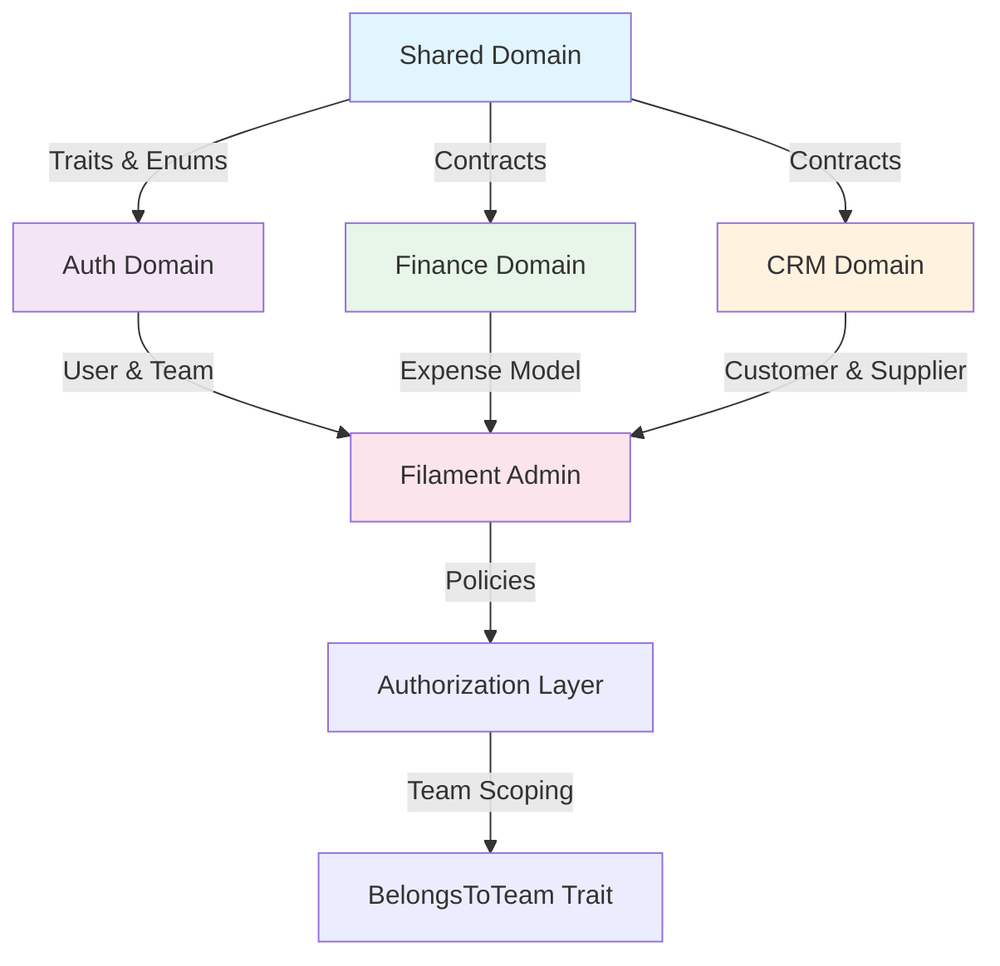
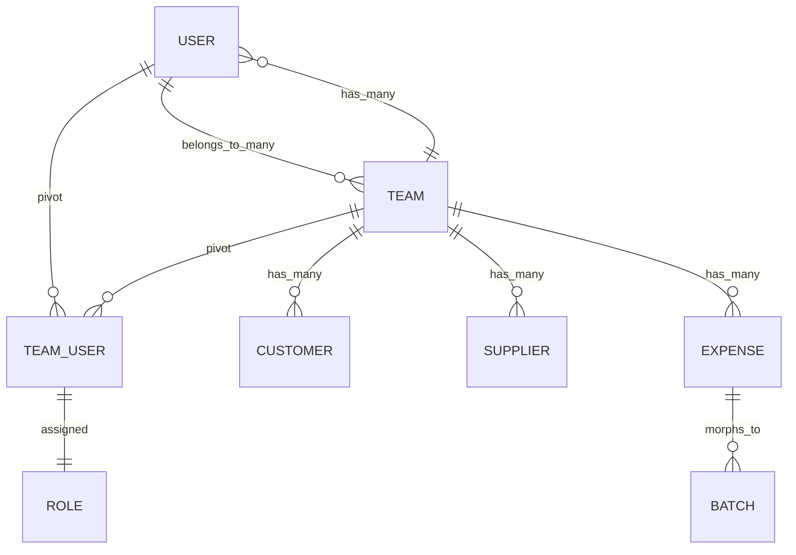
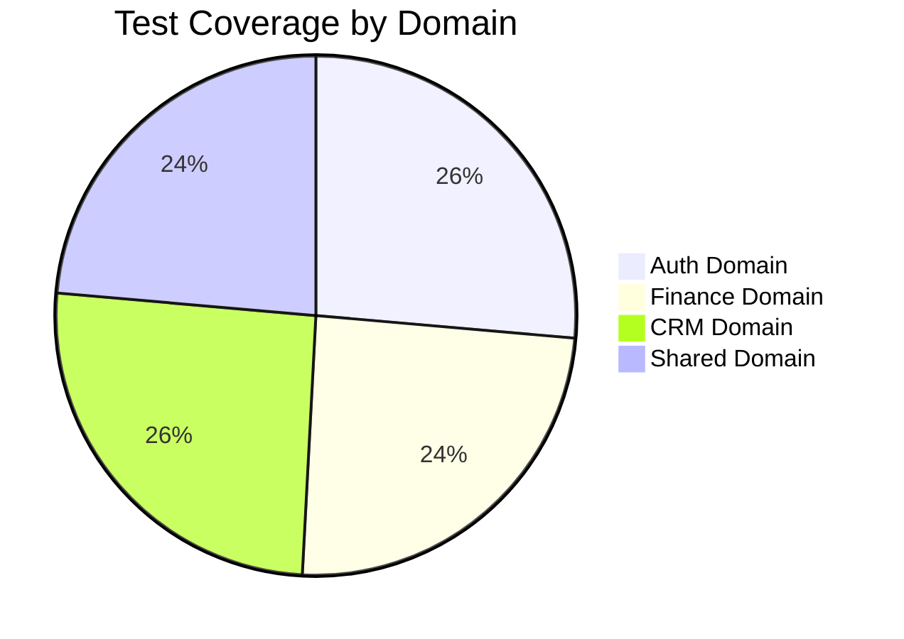
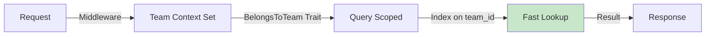
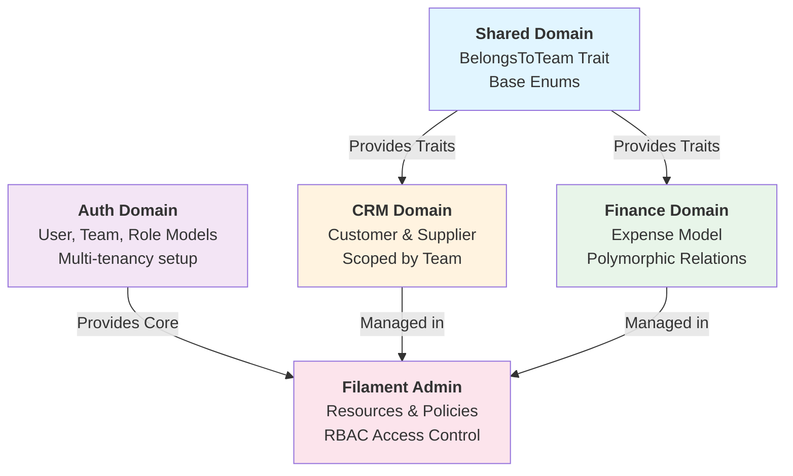

# Implementation Report Template

Use this template to document each phase implementation, including features delivered, architecture changes, and impact diagrams.

---

## Header Section

**Phase:** [Phase Number]
**Title:** [Phase Title]
**Reporting Period:** [Start Date] - [End Date]
**Status:** [In Progress / Complete]
**Time Spent:** [X hours]
**Estimated Time:** [Y hours]

---

## Executive Summary

**Objective:**
[Brief summary of what this phase aimed to accomplish]

**Key Achievements:**
- [Achievement 1]
- [Achievement 2]
- [Achievement 3]

**Blockers/Challenges:**
- [Challenge 1]
- [Challenge 2]

**Next Phase Dependencies:**
- [Dependency 1]
- [Dependency 2]

---

## Features Implemented

### Feature 1: [Feature Name]
**Status:** [Complete / In Progress]
**Time:** [X hours]

**Description:**
[What was implemented and why]

**Acceptance Criteria Met:**
- [x] Criterion 1
- [x] Criterion 2
- [x] Criterion 3

**Related Files:**
- [model.php](../../path/to/model.php)
- [migration.php](../../path/to/migration.php)
- [resource.php](../../path/to/resource.php)

**Key Code Patterns:**
```php
// Example pattern used
```

---

## Architecture Changes

### Change 1: [Architecture Decision]
**Impact Level:** [High / Medium / Low]

**Before:**
```
[Previous architecture diagram or description]
```

**After:**
```
[New architecture diagram or description]
```

**Rationale:**
[Why this change was made]

**Migration Path:**
[How existing data/code was migrated]

---

## Domain Impact Diagram



---

## Database Changes

### Migrations Created

| Migration | Tables Affected | Reason |
|-----------|-----------------|--------|
| [Migration 1](../../database/migrations/) | table_name | Brief description |
| [Migration 2](../../database/migrations/) | table_name | Brief description |

### Schema Summary

```sql
-- New Tables
teams:
  - id (PK)
  - owner_id (FK)
  - name
  - timestamps

-- Modified Tables
[table_name]:
  - [Added column]
  - [Modified column]
  - [Removed column]
```

### Data Relationships Diagram



---

## Code Changes Summary

### New Files Created
- [File Path](../../path/to/file.php) - [Purpose]
- [File Path](../../path/to/file.php) - [Purpose]

### Files Modified
- [File Path](../../path/to/file.php) - [Changes made]
- [File Path](../../path/to/file.php) - [Changes made]

### Files Deleted
- [File Path](../../path/to/file.php) - [Reason]

### Code Statistics
- **Lines Added:** [X]
- **Lines Removed:** [Y]
- **Files Created:** [N]
- **Files Modified:** [M]
- **Files Deleted:** [K]

---

## Testing Results

### Unit Tests
```
Total: [X]
Passed: [X]
Failed: [0]
Coverage: [X%]
```

**Test Files:**
- [tests/Unit/Auth/UserTest.php](../../tests/Unit/Auth/UserTest.php)
- [tests/Unit/Finance/ExpenseTest.php](../../tests/Unit/Finance/ExpenseTest.php)

### Feature Tests
```
Total: [X]
Passed: [X]
Failed: [0]
Coverage: [X%]
```

**Test Files:**
- [tests/Feature/Admin/UserResourceTest.php](../../tests/Feature/Admin/UserResourceTest.php)
- [tests/Feature/Admin/CustomerResourceTest.php](../../tests/Feature/Admin/CustomerResourceTest.php)

### Test Coverage by Domain



### Quality Metrics
- **Code Quality:** [PStan Level X, Zero errors]
- **Code Style:** [Pint formatting passed]
- **TypeScript:** [Zero type errors]
- **ESLint:** [Zero linting issues]

---

## Performance Impact

### Database Performance
- **New Indexes:** [List indexes added]
- **Query Optimization:** [Any queries optimized]
- **Migration Time:** [Approximate time for production migration]

### Application Performance
- **Load Time Change:** [Increase/Decrease]
- **Memory Usage:** [No significant change / +X MB]
- **Cache Considerations:** [Any caching added/modified]

### Performance Diagram



---

## Deployment Notes

### Pre-Deployment Checklist
- [ ] All tests passing (`php artisan test`)
- [ ] Code quality checks passing (`./vendor/bin/pint`, `npm run lint`, `npm run types`)
- [ ] No uncommitted changes
- [ ] Database backup verified
- [ ] Migrations reviewed

### Deployment Steps
1. Pull latest code
2. Run `composer install` (if dependencies updated)
3. Run `php artisan migrate`
4. Run seeders if needed: `php artisan db:seed --class=RoleAndPermissionSeeder`
5. Verify functionality in staging
6. Clear caches: `php artisan cache:clear`
7. Monitor error logs

### Rollback Plan
```bash
# If issues occur:
php artisan migrate:rollback --step=2
git revert [commit-hash]
# Restore from database backup
```

---

## Git Commits

All commits made during this phase:

| Commit Hash | Message | Files Changed |
|------------|---------|---------------|
| [abc1234](../../) | "Commit message" | N files |
| [def5678](../../) | "Commit message" | N files |
| [ghi9012](../../) | "Commit message" | N files |

**Total Commits:** [X]
**Total Changes:** [Y files, ±Z lines]

---

## Lessons Learned

### What Went Well
- [Lesson 1]
- [Lesson 2]

### What Could Be Improved
- [Improvement 1]
- [Improvement 2]

### Technical Decisions Made
- **Decision 1:** [Rationale for decision]
- **Decision 2:** [Rationale for decision]

---

## Cross-Domain Impact Analysis

### Domains Affected by This Phase



### Impact Matrix

| Domain | Scope | Impact | Status |
|--------|-------|--------|--------|
| Auth | Modified | High - Core models changed | ✅ Complete |
| Shared | Modified | High - Base traits added | ✅ Complete |
| CRM | New | Medium - New models created | ✅ Complete |
| Finance | New | Medium - New models created | ✅ Complete |
| Inventory | No Impact | - | - |
| Broiler | No Impact | - | - |

---

## Next Phase Preparation

### Remaining Work from This Phase
- [ ] Item 1
- [ ] Item 2

### Blockers for Next Phase
- [Blocker 1] - [Resolution needed]
- [Blocker 2] - [Resolution needed]

### Recommended Focus for Phase [N+1]
1. [Task 1]
2. [Task 2]
3. [Task 3]

### Phase [N+1] Estimated Effort
- **Estimated Hours:** [X]
- **Estimated Days:** [Y]
- **Team Size:** [Z people]

---

## Sign-Off

**Implemented By:** [Developer Name]
**Reviewed By:** [Reviewer Name]
**Approved By:** [Approval Name]

**Implementation Start:** [Date]
**Implementation End:** [Date]
**Report Date:** [Date]

---

## Appendix: Reference Links

- [Phase Plan](../PHASE_X.md)
- [Previous Phase Report](./PHASE_[N-1]_IMPLEMENTATION_REPORT.md)
- [PRD](../../docs/prd.md)
- [CLAUDE.md](../../CLAUDE.md)
- [Laravel Documentation](https://laravel.com/docs)
- [Filament Documentation](https://filamentphp.com/docs)
- [DDD Resources](https://en.wikipedia.org/wiki/Domain-driven_design)

---

**Report Version:** 1.0
**Last Updated:** [Date]
**Next Review:** After Phase [N+1] Completion
